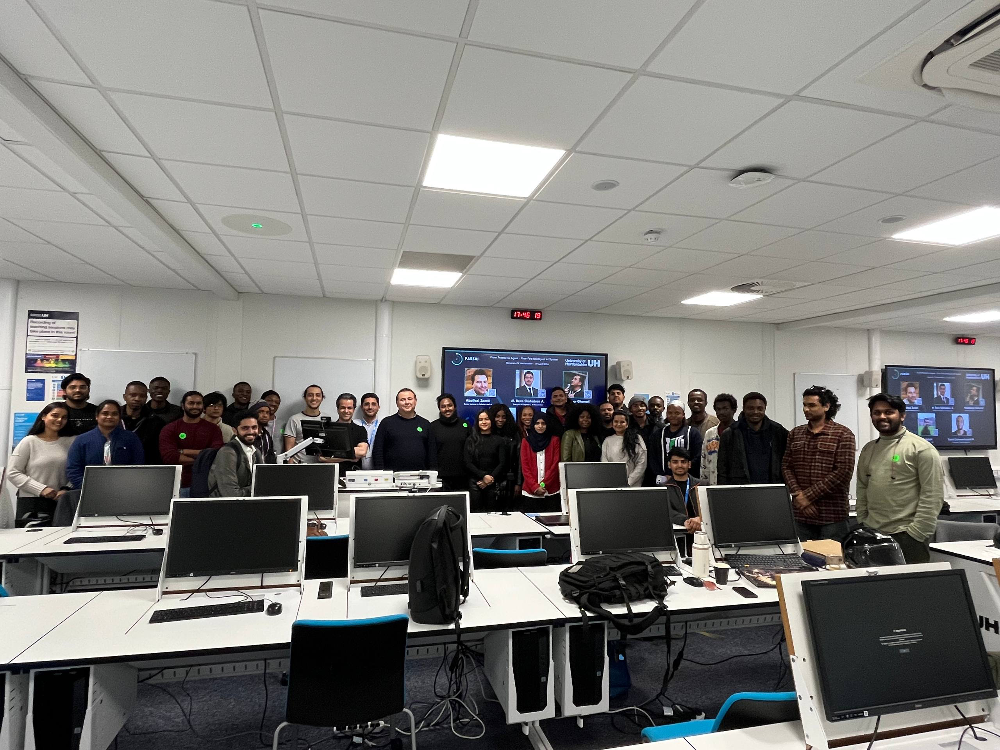
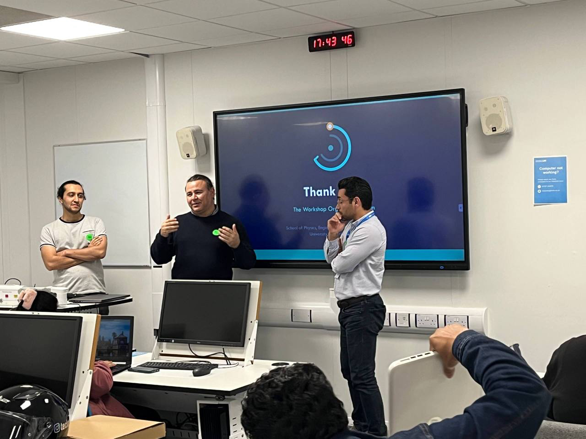
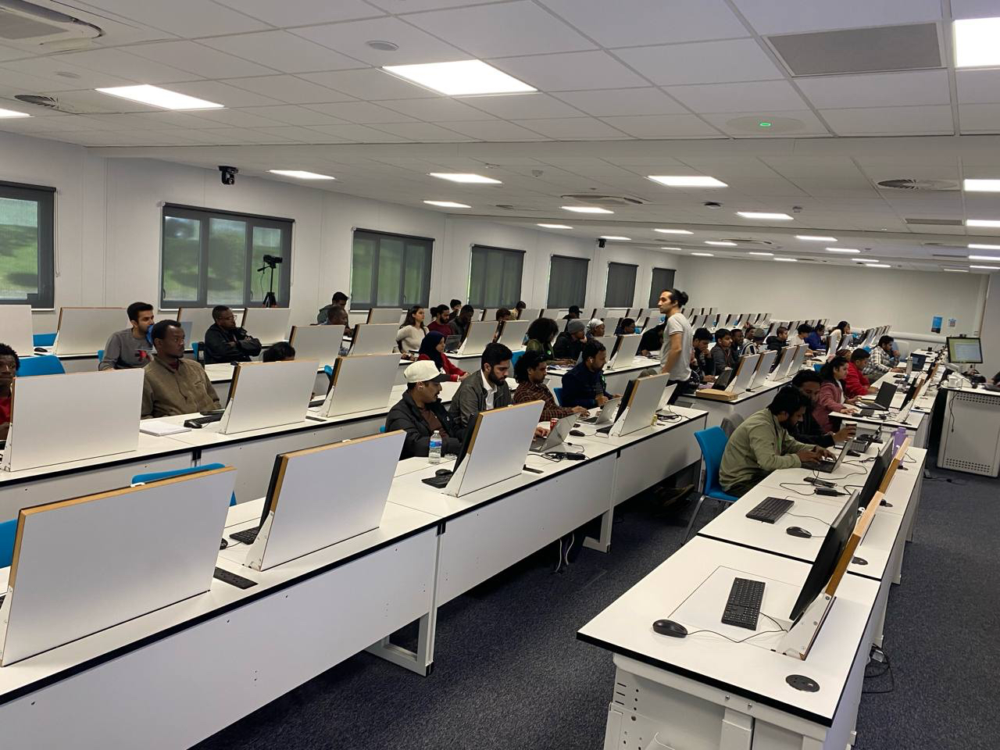

On **18 April 2026**, we ran the **From Prompt to Agent** workshop at the University of Hertfordshire.
I was one of the organizers, and I am very proud of what the team and participants built in one day.

Workshop page: [From Prompt to Agent](https://ai-event-teal.vercel.app/workshops/from-prompt-to-agent)

## What we focused on

- Moving from simple prompts to structured agent thinking.
- Designing clear workflows for practical AI systems.
- Building small, useful demos during the hands-on session.

## What made this day special

We had strong energy in the room, great collaboration, and many creative ideas from participants.
The event was technical, but still welcoming for people at different levels.

I also want to thank the full organizing and teaching team for making this possible.

## Workshop highlights

- 55 students joined us in person.
- We had more than 140 hours of online engagement.
- The live session was shared on YouTube through the `learningplustodate` channel.
- Live stream access link: [YouTube Live (learningplustodate)](https://www.youtube.com/results?search_query=learningplustodate)

## Organizing team

- [Abolfazl Zaraki](https://www.linkedin.com/in/abolfazl-zaraki-8b48b12a/)
- [Reza Shahabian](https://uk.linkedin.com/in/mrshahabian/)
- [Khashayar Ghamati](https://www.linkedin.com/in/khashayarghamati/)
- [Ali Fallahi](https://www.linkedin.com/search/results/all/?keywords=Ali%20Fallahi%20University%20of%20Hertfordshire)

## Final note

Thank you to everyone who joined and helped make this workshop a success.
This was a great step toward building more practical and human-centered AI systems.
