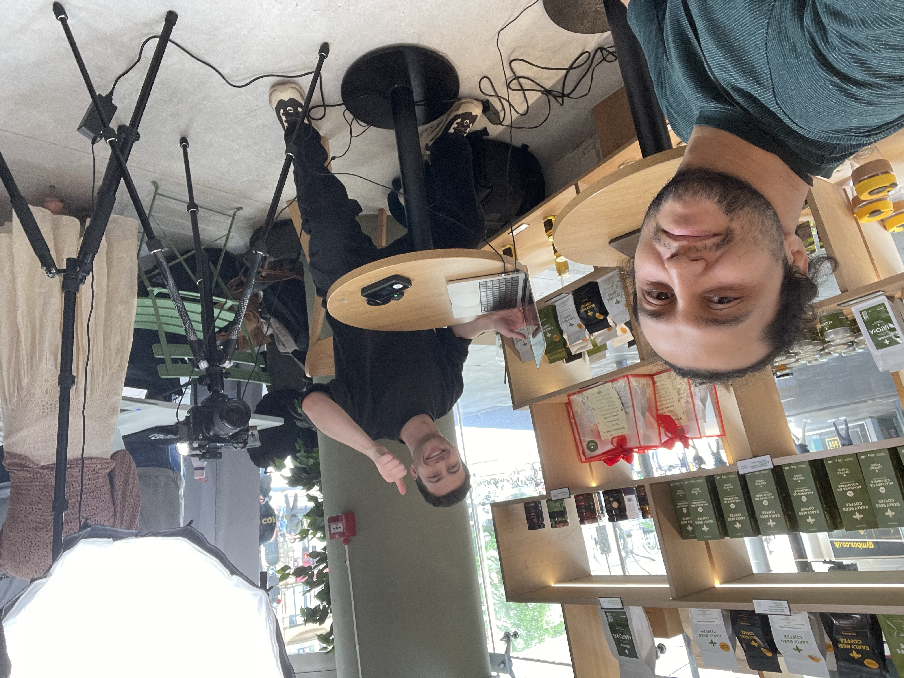
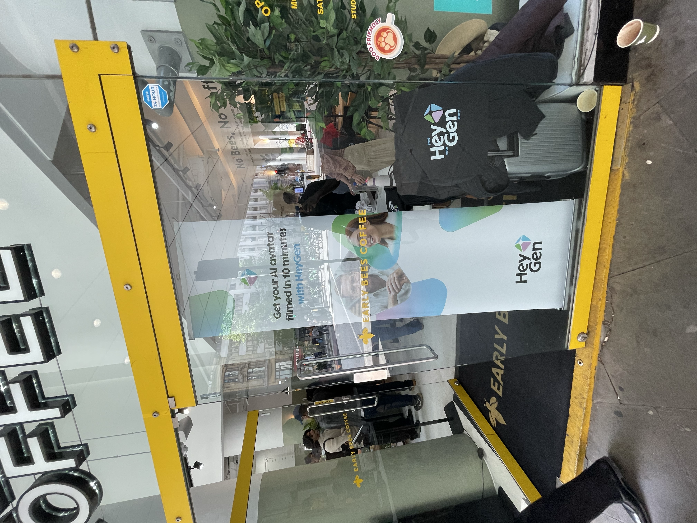

I attended HeyGen's **Infinitely Me** pop-up in London, and it was one of those events that stays with you.
In around 10 minutes, the team showed how someone can capture a high-fidelity digital version of themselves.

As an AI Engineer working on digital identity and 3D integration, this felt very relevant to my current direction.
It was exciting, a little surreal, and technically impressive at the same time.

## Quick summary

- The product flow was fast and surprisingly smooth.
- The output quality felt strong for such a short capture session.
- The biggest value was not only the demo, but the technical conversations around system design.

A highlight for me was discussing API architecture, latency optimization, and system I/O challenges with the team.
These are the details that really matter when you want these systems to work at scale.

## Event moments

## Event video

<video controls preload="metadata" poster="/videos/heygen-london-event-recap-cover.jpg" style="width:100%; border-radius: 12px; margin-top: 0.5rem;">
  <source src="/videos/heygen-london-event-recap.mp4" type="video/mp4" />
  Your browser does not support the video tag.
</video>

## Vertical recap video

<video controls preload="metadata" poster="/videos/heygen-london-vertical-recap-cover.jpg" style="display:block; width:100%; max-width:420px; border-radius: 12px; margin: 0.75rem auto 0;">
  <source src="/videos/heygen-london-vertical-recap.mp4" type="video/mp4" />
  Your browser does not support the video tag.
</video>

## Final thought

Tools for digital identity are moving very quickly.
Events like this are a good reminder that ideas that looked impossible a year ago are now practical product experiences.
