Retrieval-Augmented Generation, or **RAG**, is one of the most useful ideas in modern AI engineering. The simple version is easy to explain: instead of asking an LLM to answer only from memory, we first retrieve relevant information, then ask the model to answer using that evidence.

My personal view is that **RAG is better than using an LLM alone whenever the answer depends on private, updated, technical, or domain-specific knowledge**. A standalone model can sound confident, but it does not know your internal documents, your latest data, your product catalogue, your CV database, or your project files unless you give that context to it.

For me, the best default is usually not Naive RAG. I prefer starting with **Hybrid RAG + Query Transform + Reranking**. That combination gives a practical balance: semantic understanding, exact keyword matching, better search phrasing, and cleaner final context. I use Agentic RAG only when the task really needs planning, tools, or multiple steps, because it is powerful but harder to control.

I also created a small companion GitHub playbook with one shared example, short pseudo-code, and a simple result for each architecture: [RAG Architectures Playbook](https://github.com/danialza/RAG-Architectures-Playbook).

## Where I use each style

In my own projects, I think about RAG like this:

- For **simple internal Q&A**, I would use Naive RAG or Advanced RAG because the system only needs to answer from a known document set.
- For **CV matching, job matching, technical search, and product-style retrieval**, I prefer Hybrid RAG with Reranking because exact terms, names, skills, dates, and IDs matter.
- For **messy user questions**, I use Query-Transform RAG because real users do not always ask clean search queries.
- For **research and comparison tasks**, I like Multi-Query RAG or RAG-Fusion because one query is often not enough.
- For **AI agents, workflow automation, and systems that use APIs**, Tool-Augmented RAG or Agentic RAG makes more sense.
- For **robotics, images, videos, diagrams, and document understanding**, Multimodal RAG is the direction I find most interesting.
- For **enterprise or private data**, Secure RAG is not optional. Permissions, filtering, and auditability are part of the architecture, not an extra feature.

## 1. Naive RAG

Naive RAG is the basic version. Documents are split into chunks, converted into embeddings, stored in a vector database, and retrieved when a user asks a question.

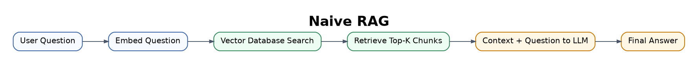

Best for simple document Q&A, small knowledge bases, FAQ bots, and basic search assistants.

The weakness is that it can retrieve irrelevant chunks or miss important context when a question needs reasoning across multiple sources.

## 2. Advanced RAG

Advanced RAG improves the basic pipeline with better chunking, metadata, query rewriting, filtering, reranking, and post-processing.

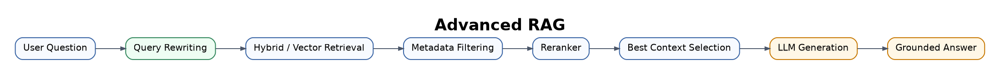

Best for professional chatbots, research assistants, technical documentation search, and enterprise knowledge systems.

This is often the first version I would consider for a serious product, because Naive RAG usually becomes limiting quite quickly.

## 3. Modular RAG

Modular RAG breaks the system into replaceable components. You can change the retriever, reranker, database, router, or generator independently.

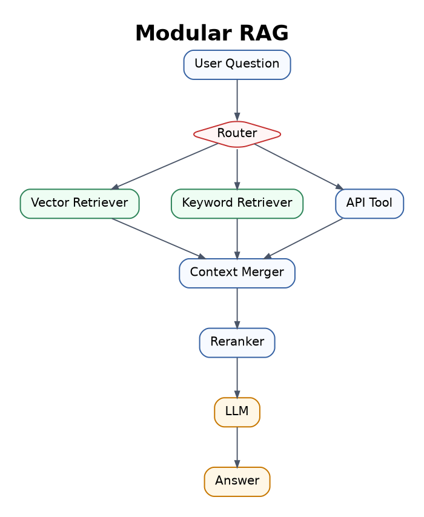

Best for larger AI products that combine documents, APIs, databases, web search, and different retrieval tools.

The trade-off is engineering complexity. Every module needs testing, monitoring, and clear responsibility.

## 4. Hybrid RAG

Hybrid RAG combines semantic vector search with keyword search. Vector search understands meaning. Keyword search is better for exact names, IDs, dates, technical terms, and product codes.

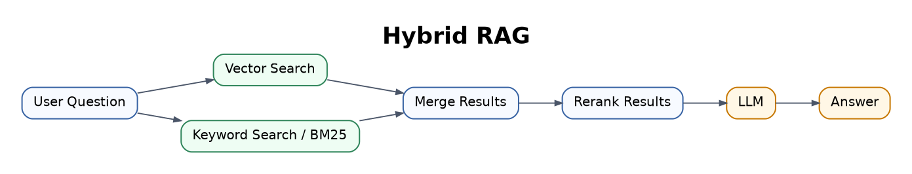

This is one of my favorite practical RAG patterns. For CV matching, technical manuals, legal documents, and product data, I do not want to rely only on semantic similarity. Exact matching still matters.

## 5. Query-Transform RAG

Query-Transform RAG rewrites the user's question before retrieval. This helps when the question is vague, too short, badly phrased, or missing useful search terms.

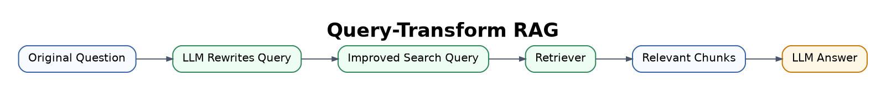

Example:

Original question: "What about the visa thing?"

Rewritten query: "What are the UK student visa rules for self-employment and online income?"

I like this pattern for user-facing systems because users naturally ask casual questions.

## 6. Multi-Query RAG

Multi-Query RAG generates several alternative versions of the same question and searches with all of them.

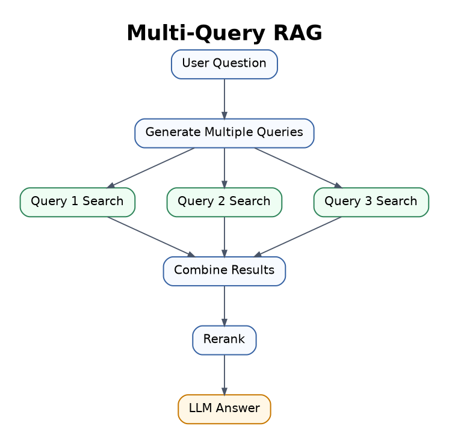

Best for research, academic search, and complex topics where the same idea can be worded in different ways.

The cost is higher because the system performs multiple searches.

## 7. RAG-Fusion

RAG-Fusion is close to Multi-Query RAG, but it also ranks and fuses results from multiple generated queries.

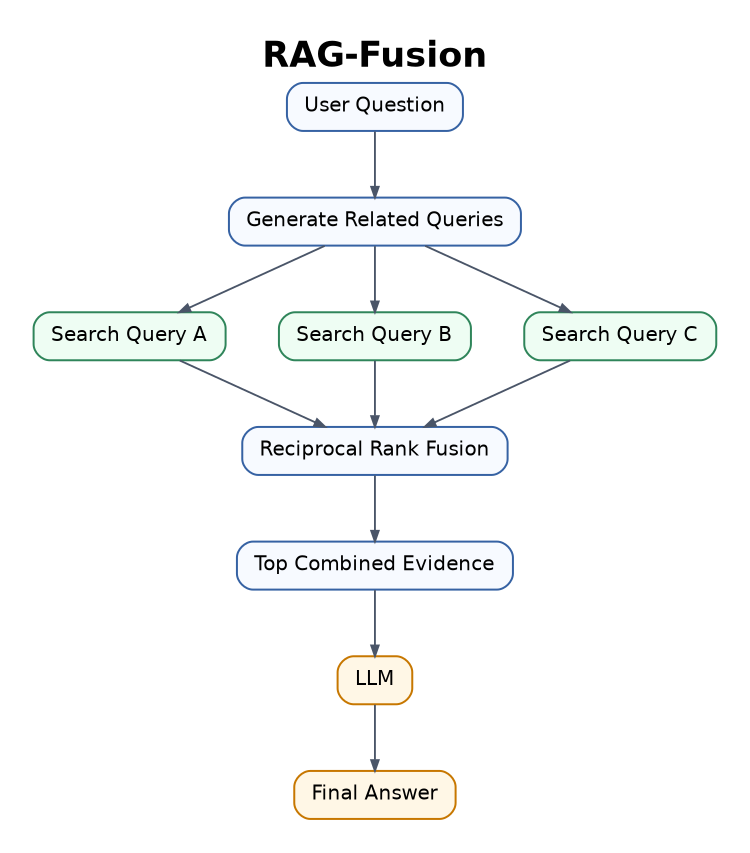

Best for deep research, comparison posts, literature reviews, and long-form answers.

From my point of view, this is better than plain Multi-Query RAG when the answer needs evidence from several search angles.

## 8. HyDE RAG

HyDE means Hypothetical Document Embeddings. The model first generates a hypothetical answer or document, then embeds that generated text for retrieval.

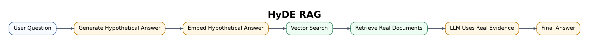

Best for short or abstract questions.

The risk is that the hypothetical answer can point retrieval in the wrong direction.

## 9. Reranking RAG

Reranking RAG first retrieves many candidate chunks, then uses a stronger model to reorder them and keep only the most relevant ones.

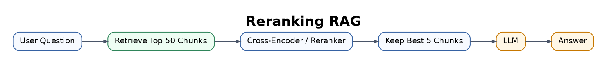

This is another pattern I use often. The first retrieval step is rarely perfect, so reranking is a very practical way to improve answer quality.

The trade-off is extra latency and cost.

## 10. Self-RAG

Self-RAG lets the model check whether it needs retrieval, whether the retrieved context is useful, and whether the final answer is supported by evidence.

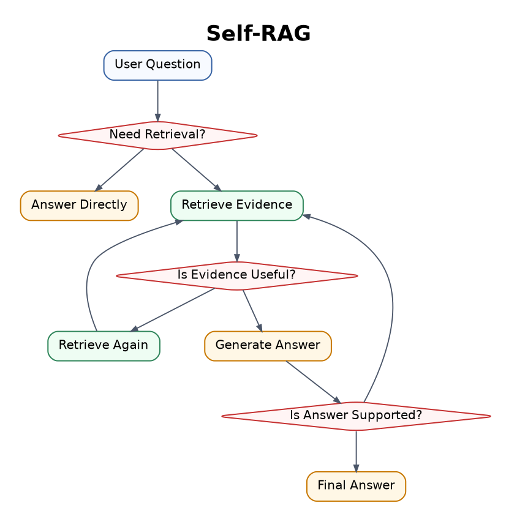

Best for factual systems where grounding matters.

It can be slower, but the extra checking is useful when hallucination is expensive.

## 11. Corrective RAG

Corrective RAG, or CRAG, checks whether retrieved documents are good enough. If the context is weak, the system can search again, refine the documents, or use web search.

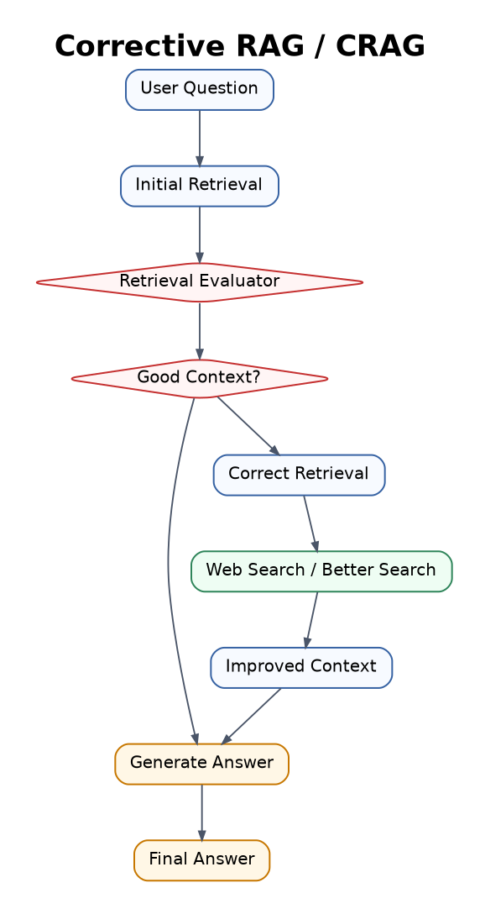

Best for open-domain Q&A, research assistants, and systems where retrieval quality can vary.

The hard part is building a reliable evaluator.

## 12. Adaptive RAG

Adaptive RAG chooses the retrieval strategy depending on the question. Easy questions may need no retrieval. Factual questions may need basic retrieval. Complex questions may need multi-step retrieval or tools.

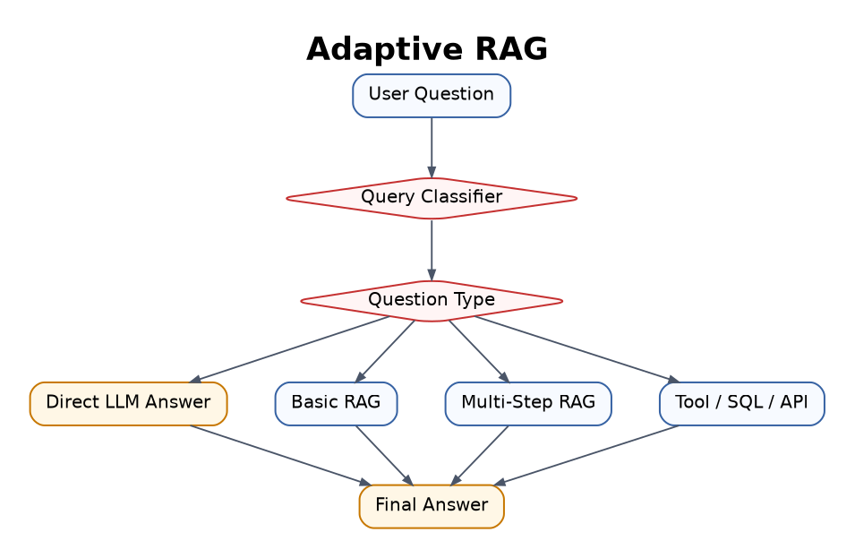

Best for production assistants that handle many different types of user questions.

The router or classifier must be accurate, otherwise the system chooses the wrong path.

## 13. Agentic RAG

Agentic RAG uses an AI agent to plan, search, use tools, evaluate results, and repeat steps until it has enough information.

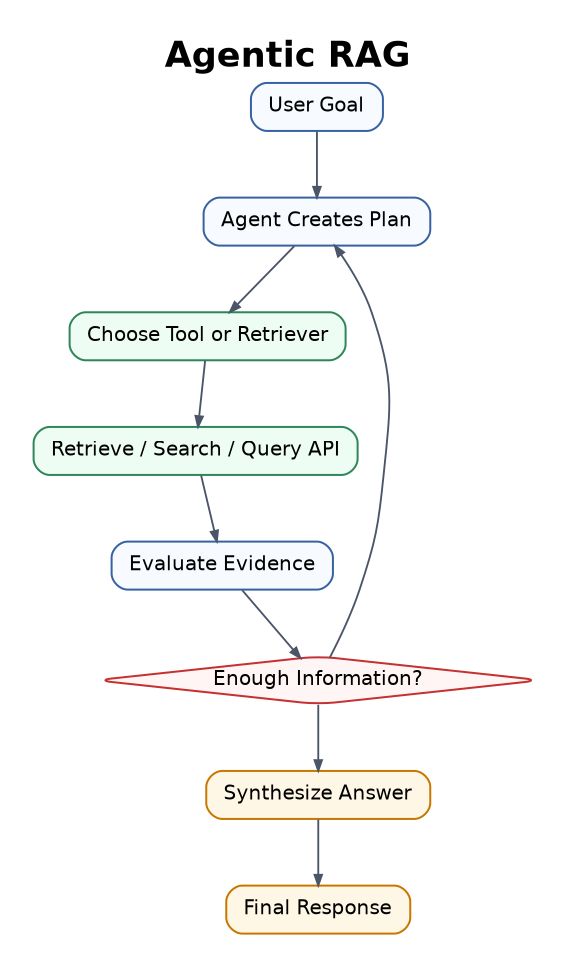

This is powerful for complex research, business intelligence, coding agents, legal assistants, and multi-step workflows.

My opinion: Agentic RAG is not always better. It is better when the task needs planning and tools. For normal Q&A, it can be too much.

## 14. GraphRAG

GraphRAG uses graph structures, such as entities, relationships, communities, and links between concepts. Instead of retrieving isolated chunks, it retrieves connected information.

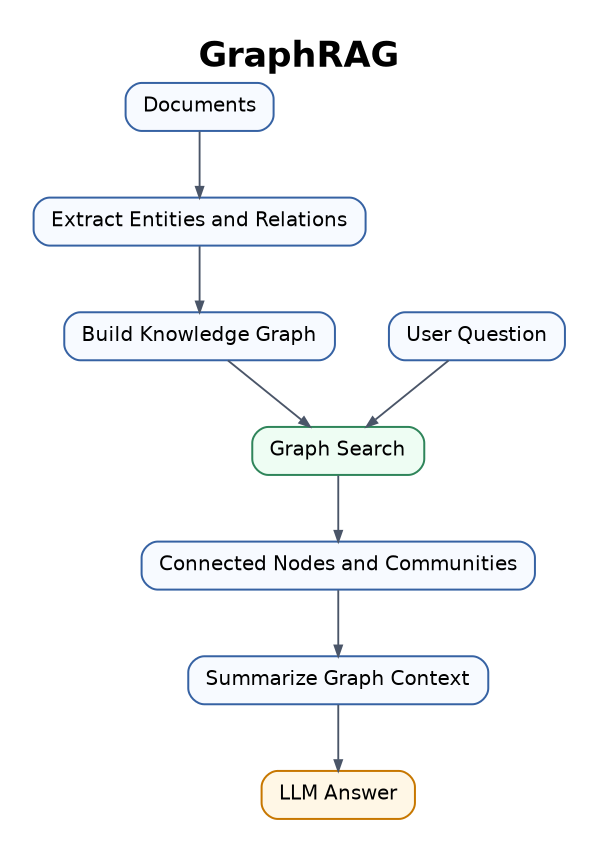

Best for complex domains with many relationships, such as research papers, legal cases, company knowledge, medical knowledge, finance, and history.

## 15. Knowledge Graph RAG

Knowledge Graph RAG uses structured facts such as:

Person -> works_at -> Company

Drug -> treats -> Disease

Paper -> cites -> Paper

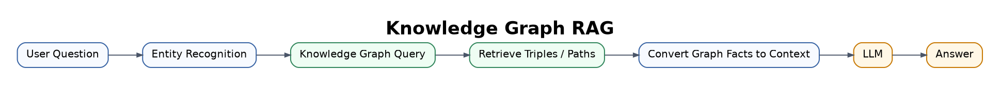

Best for medical, scientific, legal, and enterprise systems where relationships matter.

## 16. Multi-Hop RAG

Multi-Hop RAG retrieves information in several steps. The answer cannot be found in one document, so the system connects facts across multiple sources.

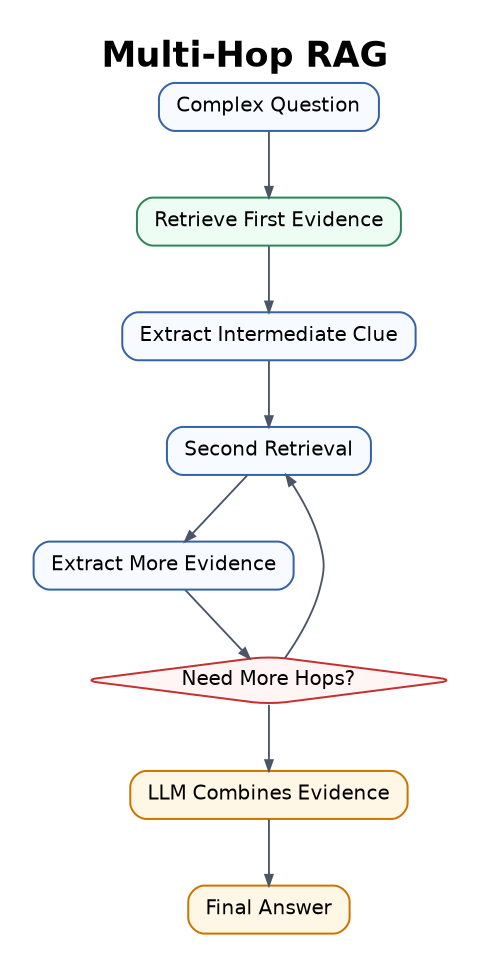

Best for investigation tasks, research questions, comparison articles, and reasoning-heavy Q&A.

The risk is that errors can accumulate across retrieval steps.

## 17. Hierarchical RAG

Hierarchical RAG, sometimes connected with RAPTOR-style approaches, organizes documents into a tree of summaries. The system can search high-level summaries first, then drill down into details.

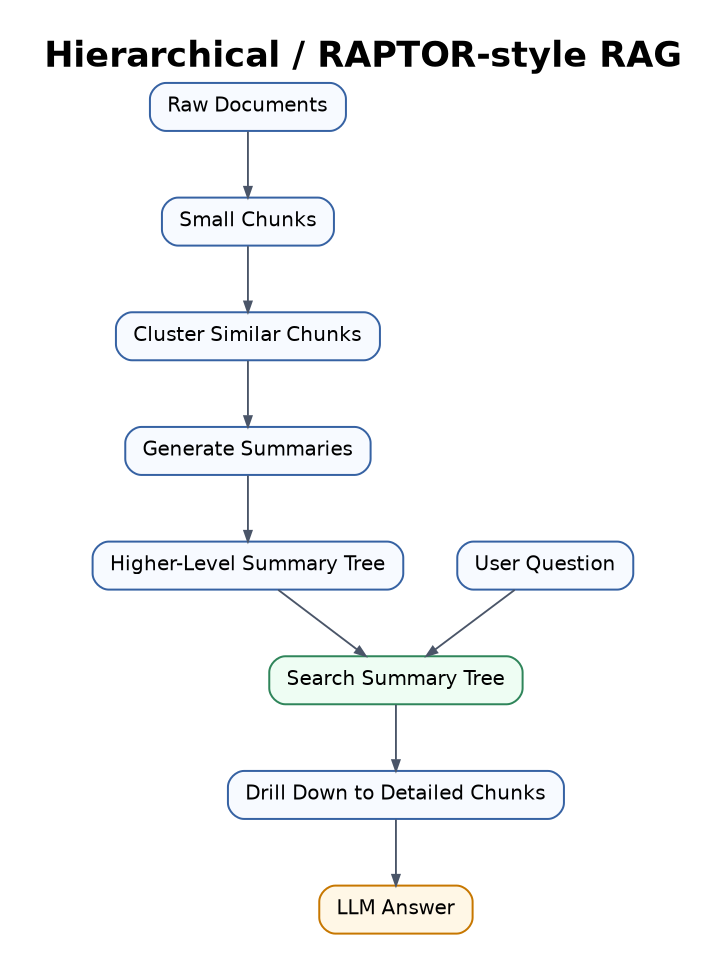

Best for large documents, books, long reports, research libraries, and big knowledge bases.

## 18. Long-Context RAG

Long-Context RAG retrieves larger sections or entire documents and sends them to a model with a large context window.

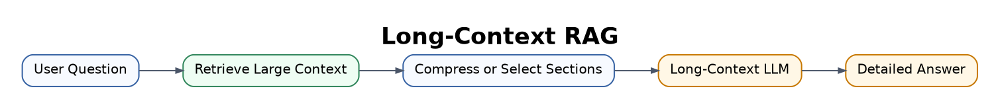

Best for long contracts, academic papers, technical manuals, and reports.

I see this as useful, but not a replacement for good retrieval. More context does not automatically mean better context.

## 19. Multimodal RAG

Multimodal RAG retrieves and uses different data types: text, images, tables, charts, audio, video, and PDFs.

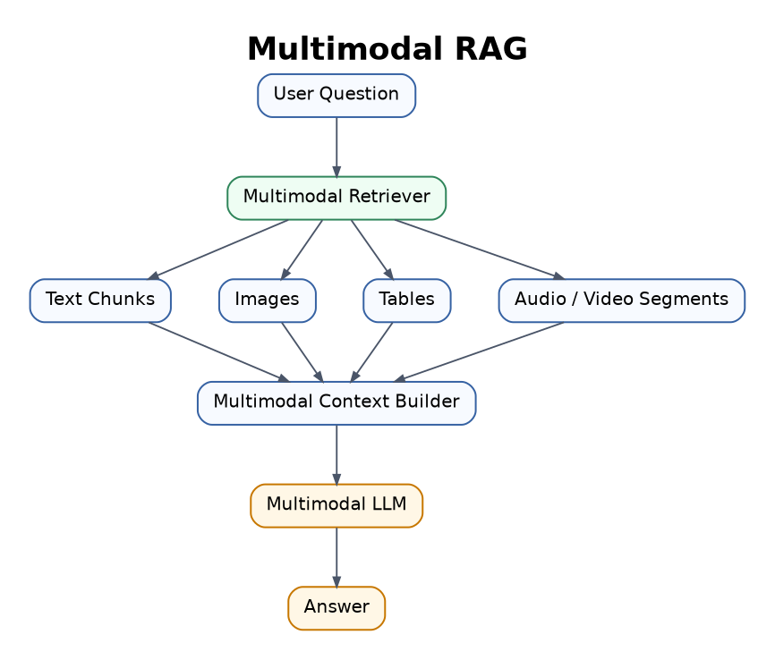

This is one of the most exciting areas for me because it connects strongly with robotics, visual understanding, education, product search, and document AI.

## 20. Structured Data RAG / SQL RAG

Structured Data RAG retrieves information from SQL tables, spreadsheets, CRMs, dashboards, and business databases.

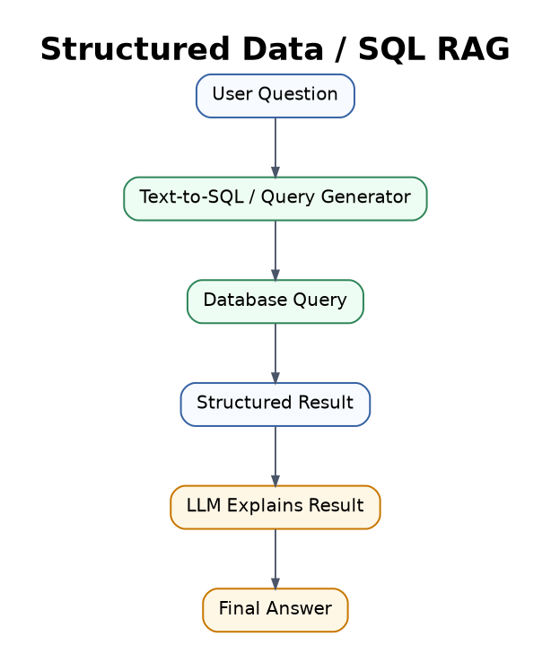

Best for business analytics, dashboards, sales reports, finance, HR systems, and inventory search.

The generated SQL must be correct and safe.

## 21. API / Tool-Augmented RAG

Tool-Augmented RAG retrieves information from documents and also uses tools, APIs, calculators, search engines, calendars, CRMs, or software systems.

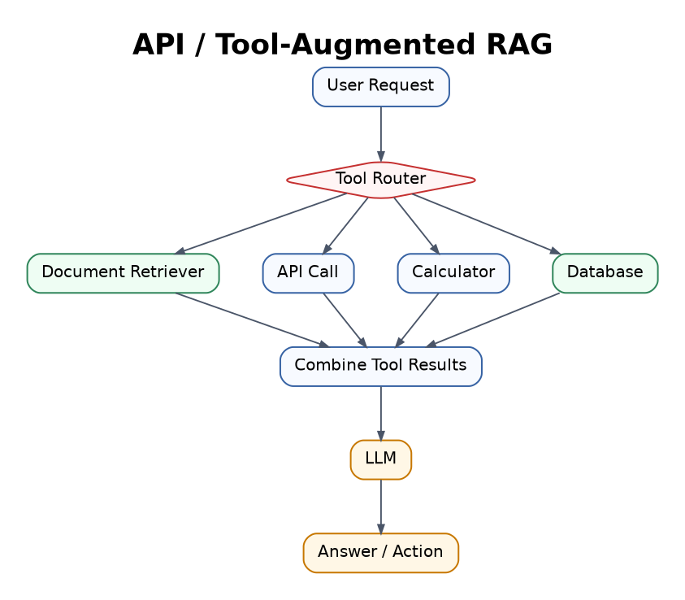

Best for AI agents, workflow automation, booking systems, coding assistants, and business operations.

This is where RAG starts to move from "answering" toward "doing".

## 22. Real-Time RAG

Real-Time RAG retrieves live or frequently updated information, such as news, prices, stock data, weather, sports, or current company data.

Best for news assistants, finance tools, travel planning, live dashboards, and market research.

The challenge is that fresh information can be noisy or conflicting.

## 23. Personalised RAG

Personalised RAG retrieves information specific to one user, such as notes, preferences, uploaded files, calendar, emails, CV, projects, or learning history.

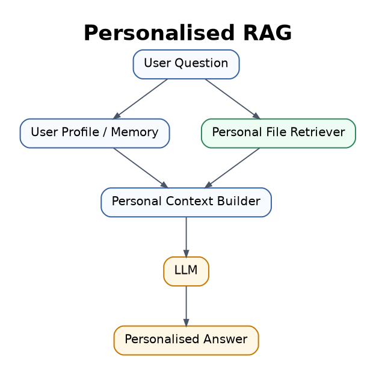

Best for personal assistants, learning tutors, CV tailoring systems, productivity tools, and private research assistants.

This is useful, but privacy and permission control matter a lot.

## 24. Secure / Enterprise RAG

Secure RAG focuses on permission control, privacy, compliance, audit logs, access filtering, and data leakage prevention.

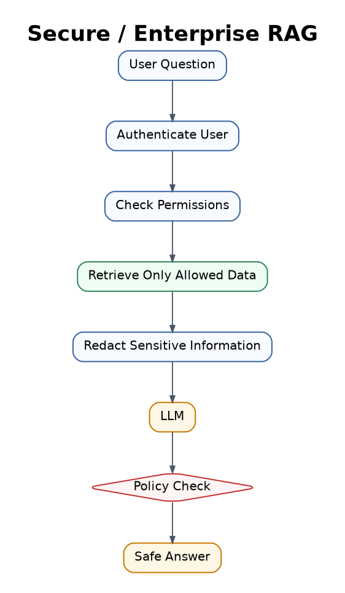

Best for healthcare, finance, legal, education, government, and enterprise AI systems.

In my opinion, this is the difference between a demo and a real system. If users should not see some data, the retriever must enforce that before the LLM ever sees it.

## Quick comparison

| RAG type | Main idea | Best use case | Complexity |
|---|---|---|---|
| Naive RAG | Basic retrieve + generate | Simple Q&A | Low |
| Advanced RAG | Better retrieval and reranking | Professional knowledge bots | Medium |
| Modular RAG | Replaceable components | Scalable AI products | Medium-High |
| Hybrid RAG | Vector + keyword search | Technical, legal, product data | Medium |
| Query-Transform RAG | Rewrite question before search | Messy user questions | Medium |
| Multi-Query RAG | Search with multiple query versions | Research and broad topics | Medium |
| RAG-Fusion | Merge ranked results from many queries | Deep research | Medium-High |
| HyDE RAG | Generate hypothetical answer before search | Abstract questions | Medium |
| Reranking RAG | Reorder retrieved chunks | High-accuracy search | Medium |
| Self-RAG | Check retrieval and answer quality | Factual systems | High |
| Corrective RAG | Fix bad retrieval | Robust Q&A | High |
| Adaptive RAG | Choose strategy by question type | General assistants | High |
| Agentic RAG | Agent plans and uses tools | Complex workflows | Very High |
| GraphRAG | Use graph relationships | Connected knowledge | High |
| Knowledge Graph RAG | Use structured triples | Medical, legal, scientific systems | High |
| Multi-Hop RAG | Retrieve in multiple reasoning steps | Investigation and research | High |
| Hierarchical RAG | Search summaries then details | Large document libraries | High |
| Long-Context RAG | Retrieve larger context | Long reports and contracts | Medium |
| Multimodal RAG | Retrieve text, images, tables, video | Visual and document AI | High |
| SQL RAG | Query structured databases | Analytics and BI | Medium-High |
| Tool-Augmented RAG | Use tools and APIs | AI agents | High |
| Real-Time RAG | Use live data | News, finance, travel | Medium |
| Personalised RAG | Use personal context | Personal assistants | High |
| Secure RAG | Permission-aware retrieval | Enterprise systems | Very High |

## Final thought

RAG started as a simple search-plus-generation pipeline, but modern RAG is now a complete AI architecture. It can search, verify, reason across sources, use tools, understand graphs, process multiple data types, and operate securely in real systems.

My practical rule is simple:

Start with the smallest RAG architecture that can solve the problem well. Add complexity only when retrieval quality, reasoning, tools, privacy, or scale truly require it.
