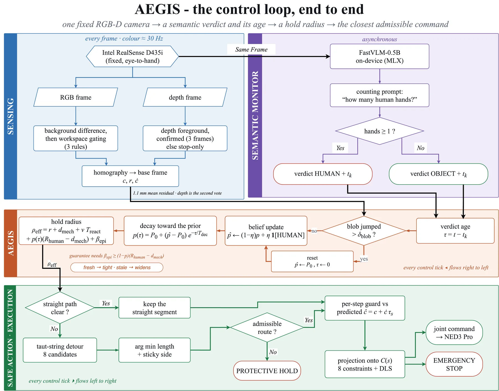
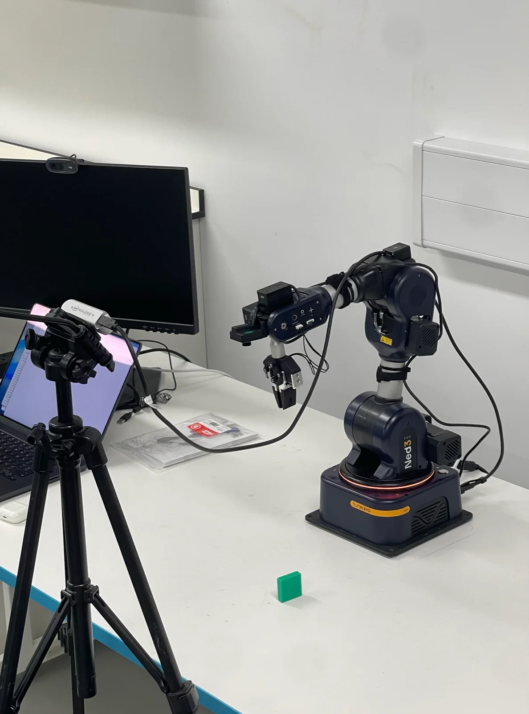
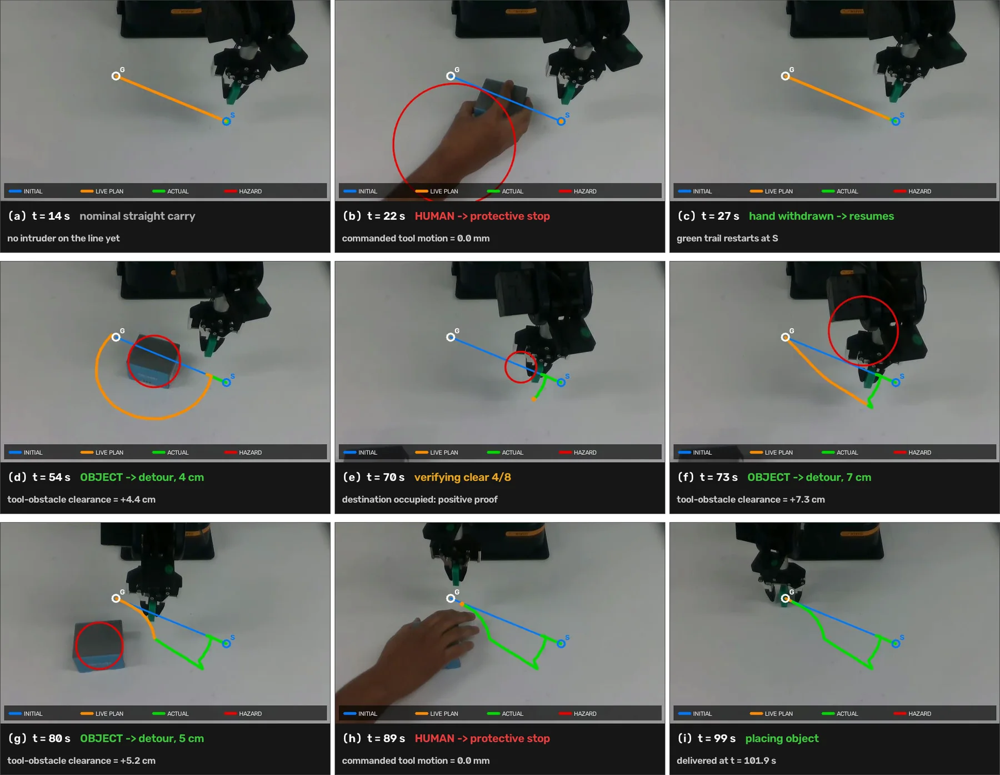
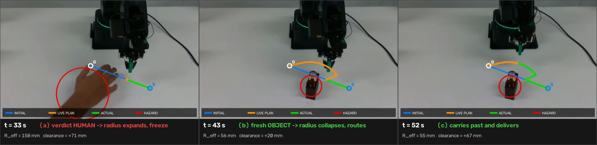
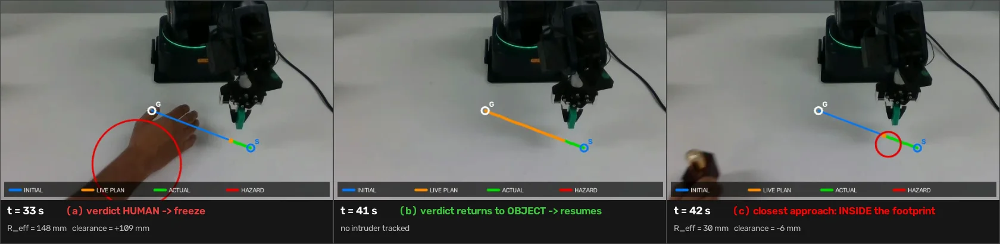

## Article

**AEGIS: An Age-Aware, Evidence-Guarded Safe-Action Layer Fusing RGB-D Sensing with Vision-Language Monitoring for Collision-Aware Robotic Manipulation**

Danial Zafaranchizadeh Moghaddam¹, Maryam Banitalebi Dehkordi¹, Hamed Rahimi Nohooji² and Abolfazl Zaraki¹\*

¹ School of Physics, Engineering and Computer Science (SPECS), University of Hertfordshire, Hatfield AL10 9AB, UK  
² Interdisciplinary Centre for Security, Reliability and Trust (SnT), University of Luxembourg, 1855 Luxembourg  
\* Corresponding author: `a.zaraki@herts.ac.uk`

**Status:** Preprint available; submitted to *Sensors*, Sensing and Imaging section.

**Preprint:** [Read the manuscript on Preprints.org](https://www.preprints.org/manuscript/202608.1220)

**Preprint DOI:** [10.20944/preprints202608.1220.v1](https://doi.org/10.20944/preprints202608.1220.v1)

**Peer-reviewed journal page:** To be added after publication

## One-Line Abstract

AEGIS is a policy-agnostic safe-action projection for manipulation whose hold radius depends on semantic belief and verdict age; with the epistemic buffer matched at zero, it kept 41% of semantic-switch episodes free of any commanded approach to a person, compared with 27% for trust-latest (*n* = 250 matched seeds, *p* = 2.7 × 10⁻⁴).

## Project Overview Video

<video controls playsinline preload="metadata" poster="/videos/aegis/aegis-project-overview-poster.jpg" src="/videos/aegis/aegis-project-overview.mp4" style="width:100%;"></video>

*A five-minute walkthrough of the complete AEGIS pipeline, from real-hardware semantic routing and protective holds to simulation audits of the safe-action layer.*

## Project Summary

AEGIS is evaluated on a low-cost Niryo NED3 Pro performing pick-and-place around an obstacle, using one fixed Intel RealSense D435i and no external safety scanner or motion-capture system. Its geometric layer checks each commanded step against eight forward-kinematics-coupled constraints at control rate and projects an unsafe proposal to the closest admissible command. Above it, an asynchronous on-device vision-language monitor decides whether the tracked intruder is a person or an object. The semantic verdict arrives only every few hundred milliseconds and becomes stale between updates. Trusting it without regard to age can leave an intermittently incorrect margin, while ignoring semantics forces a permanently conservative response. AEGIS resolves this by relaxing the semantic belief towards a cautious prior as its evidence ages, then converting that belief into a changing hold radius. The result is a policy-agnostic layer that can route, hold or modify a command without retraining the planner behind it.

## The Idea in One Figure



*The end-to-end loop couples calibrated sensing, timestamped semantic evidence, age-aware belief and geometric command projection.*

- **Sensing:** the fixed RGB-D camera localises the intruder in the robot base frame.
- **Semantic evidence:** the asynchronous monitor attaches a human-or-object verdict and timestamp to the same scene.
- **Age-aware margin:** the belief decays towards a cautious prior as the verdict ages, causing the hold radius to widen.
- **Safe action:** the geometric layer selects the closest admissible command, routes around the intruder or holds when no admissible route remains.

In words, the hold radius is the detected footprint plus mechanical clearance, the distance the hazard can cover during the robot's reaction, a semantic term scaled by the belief that the intruder is human and an epistemic buffer that never fully trusts a single verdict.

## Headline Results

| Quantity | Result |
| --- | --- |
| Age-indexed vs trust-latest, mechanism isolation | 41% vs 27% human-safe, exact McNemar *p* = 2.7 × 10⁻⁴, *n* = 250 matched seeds, epistemic buffer = 0 for both |
| Same comparison with a shared 25 mm buffer | 19% vs 20% human-safe, *p* = 0.78; the wider radius increases dwell beside the hazard |
| Constant-belief ablation | no tested constant belief is competitive on both delivery and human-safe outcomes |
| Full 6-DoF simulation, same delivery | 73.3% vs 46.7% human-respecting clearance for AEGIS vs trust-latest, with 90% delivery for both, *n* = 30 |
| Per-step unsafe cost, sampling-based planner | 0.138 → 0.0086 (16×), Wilcoxon *p* = 1×10⁻⁶, *n* = 36 paired episodes |
| Task success, same comparison | 65% → 92%, exact McNemar *p* = 0.007 |
| Physical AEGIS runs | minimum moving clearance +19.7 mm, never negative |
| Physical trust-latest baseline | one run entered the detected footprint at −5.6 mm |
| Physical worst-case baseline | zero moving ticks across 1,563 hazard ticks; no delivery when the obstacle remained |
| On-device semantic verdict | FastVLM-0.5B, 0.236 s mean, 0.238 s p95, 20 timed queries |
| Image-to-table calibration | 0.92 mm mean fitting residual over nine points |
| Hand-to-freeze reaction, hosted backend | 1.73 s mean, 2.67 s worst, *n* = 5 intrusions |

The mechanism result is a position in a trade-off, not dominance over both endpoints. Worst-case is safest when waiting is free, but delivers 0% when a persistent obstacle blocks the corridor; AEGIS delivers every episode in that persistent case. The 41% vs 27% result is the unconfounded comparison of the age-indexed rule. The small physical comparison does not hold the buffer fixed and is therefore a mechanism demonstration, not the primary statistical test.

Task success rises because the projection removes boundary- and obstacle-grazing commands that were also causing the planner to fail, so safety and task performance move together rather than trading off.

## Visual Summary

**Laboratory rig**



*The physical platform: arm, task object and a single camera on a tripod across the table.*

**Control loop**


*The same RGB-D scene feeds the fast geometric path and the asynchronous semantic path before both meet at the age-aware hold radius.*

**Semantic contrast**



*Nine panels from a single carry: the robot freezes for a hand and routes around a box, with nothing changing except the verdict.*

**Radius policy comparison**



*AEGIS breathes with evidence age: it expands for a human verdict, then collapses on fresh object evidence and resumes the route.*



*The trust-latest baseline keeps the latest object verdict at face value and enters the detected footprint during the blind interval.*

## What Is Honest About This Work

The clearance result is proved for the constrained tool point, not the whole arm. A whole-arm audit found the forearm crossing the hazard sphere in 7 of 120 simulated episodes. This is why the work is described as **collision-aware**, not collision-free.

Verdict age is currently measured from the time inference returns rather than the time the image was captured. That shortens the enforced age and can under-size the radius by up to 29.8 mm in simulation and 17.9 mm on the arm. The respective 25 mm and 12 mm epistemic buffers absorb most, but not all, of this clock error.

The semantic parser also fails permissively: an unreadable reply is interpreted as zero hands. Safety in that case comes from the geometric layer, not from an assumed perfect language model. The conditional propositions depend on stated assumptions, and the deployed semantic scores and buffers do not establish their sufficient condition, so the hardware result remains empirical rather than an instance of that guarantee.

The −5.6 mm trust-latest event followed a four-tick, 0.5 s loss of the intruder track. Clearance was increasing on every negative tick, so no inward command was admitted; the observation shows that the smaller margin admitted an incursion during a perception gap, not that verdict trust alone caused it. The hardware reference-policy sample is also small and unequal. Stating these boundaries alongside the run logs keeps each claim tied to the evidence tier that supports it.

The distance margin is informed by ISO/TS 15066 speed-and-separation concepts, but this prototype is neither an implementation nor a certification of that standard.

## Code, Data and Video

The [public companion repository](https://github.com/danialza/aegis-safe-action-layer) contains the figures, per-control-tick logs for every physical run, calibration reports, simulation episode records, a run manifest linking every reported number to its source and a claims-to-code map.

The [video supplement](https://github.com/danialza/aegis-safe-action-layer/releases/tag/v1.0) contains 19 clips, about 21 minutes in total, all recorded on the physical Niryo NED3 Pro.

The safe-action layer, sensing pipeline and hardware bridge are maintained separately and are available to researchers on request. For access, email Danial Zafaranchizadeh Moghaddam at `danial.za@outlook.com` or Abolfazl Zaraki at `a.zaraki@herts.ac.uk`. Please include your affiliation and intended reproduction or research use.

## Experimental Scope

The evidence is separated into three tiers: a kinematic comparison over 250 seeds, a full 6-DoF MuJoCo campaign over 30 seeds and 13 physical-arm runs, of which 11 are analysed. The reported scope is one platform, one task family, one intruder at a time, planar obstacles and a workspace of roughly 20 × 20 cm. These boundaries prevent the tabletop results from being read as a whole-arm, multi-person or certified safety evaluation.

## Citation and Reuse

Figures, videos and logs are released under CC BY 4.0. Please retain author attribution and cite the paper when reusing them.

```bibtex
@article{zafaranchizadeh_moghaddam_aegis,
  title = {AEGIS: An Age-Aware, Evidence-Guarded Safe-Action Layer Fusing RGB-D Sensing with Vision-Language Monitoring for Collision-Aware Robotic Manipulation},
  author = {Zafaranchizadeh Moghaddam, Danial and Banitalebi Dehkordi, Maryam and Rahimi Nohooji, Hamed and Zaraki, Abolfazl},
  journal = {Preprints},
  year = {2026},
  doi = {10.20944/preprints202608.1220.v1},
  url = {https://www.preprints.org/manuscript/202608.1220},
  note = {Preprint; not peer reviewed}
}
```

## Related Work on the Same Platform

- [Nussbaum-PID real-hardware deployment](/projects/hardware-aware-nussbaum-pid/)
