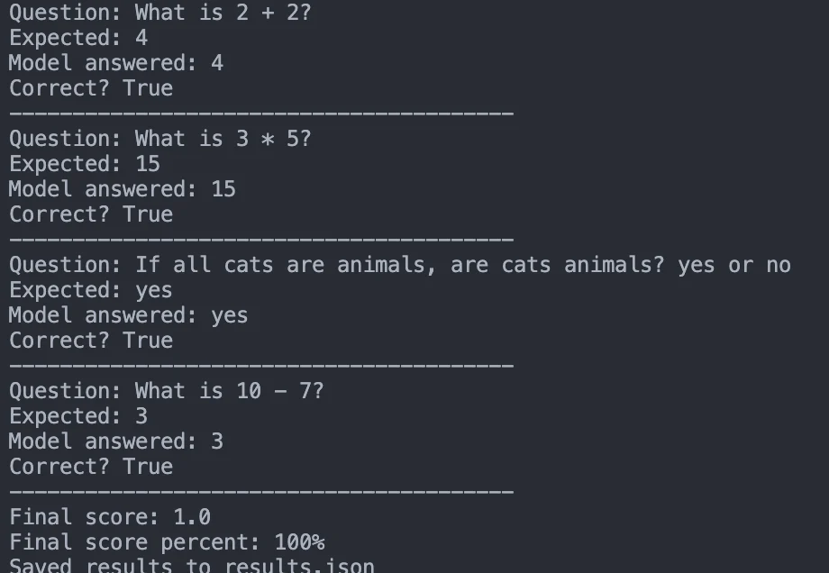

## Role

Developer and Technical Writer - AI Evaluation, Python, LangChain, and Gemini Integration

## Project Summary

This project is a small, practical explanation of what an **AI evaluation harness** is.

The idea came from a simple gap: I understood the concept and had already used similar thinking in my own AI work, but when I was asked to explain it clearly, the answer became harder than expected. So I built a tiny project that turns the concept into something visible and runnable.

An evaluation harness is not the model itself. It is the test system around the model:

```text
dataset -> prompt -> model -> grader -> results.json
```

In plain language, it is like an exam system for AI. It gives the model known questions, collects the answers, grades them, and saves the result so the run can be inspected later.

## Repository

[AI Evaluation Harness](https://github.com/danialza/ai-evaluation-harness)

## Why I Built It

AI evaluation can sound more complicated than it needs to be. In real projects, evaluation quickly involves benchmarks, dashboards, regression tests, human review, prompt versions, model versions, and cost tracking. But the core idea is much smaller:

**Can this model answer these known questions correctly?**

This repo explains that idea with a tiny Python harness first, then upgrades it to a more realistic LangChain/Gemini version.

## Two Levels

### Level 1: No API

The first version uses no API key and no external model. It uses a tiny local "fake model" so the evaluation loop is easy to see without setup friction.

That version teaches the shape of the system:

- define a dataset,
- turn each question into a prompt,
- send the prompt to a model-like function,
- grade the answer,
- print the score,
- save structured output.

This makes the harness understandable before adding real model calls.

### Level 2: With API

The second version keeps the same evaluation structure, but swaps the connector layer:

```text
dataset -> LangChain prompt -> Gemini -> grader -> results.json
```

The project uses `langchain-google-genai` for Gemini support. API keys are read from local environment variables or `.env`, and the real `.env` file is ignored by git.

## Example Result

The latest Gemini run completed all 4 tiny questions correctly:

- model: `gemini-3.5-flash`
- total questions: `4`
- correct answers: `4`
- score: `1.0`
- score percent: `100%`



The saved result is stored in `results.json`:

```json
{
  "model": "gemini-3.5-flash",
  "total_questions": 4,
  "correct_count": 4,
  "score": 1.0,
  "score_percent": 100
}
```

The important part is not that Gemini solved four simple questions. The important part is that the project shows the full evaluation path from input data to saved result.

## Core Components

The project breaks the harness into four pieces:

- **Dataset**: the exam questions and expected answers.
- **Prompt template**: how each question is shown to the model.
- **Model connector**: the layer that talks to the fake model or Gemini.
- **Grader**: the logic that decides whether the answer is correct.

This separation matters because in a larger AI system each piece changes independently. You may keep the same dataset but test a new prompt. You may keep the same prompt but switch from Gemini to another model. You may keep the same model but improve the grader.

## What Was Built

- `tiny_eval_harness.py`: a dependency-free beginner version.
- `langchain_eval_harness.py`: a LangChain version with fake-model and Gemini modes.
- `requirements-langchain.txt`: dependencies for the LangChain/Gemini path.
- `.env.example`: safe local configuration for API keys.
- `results.json`: structured output from the latest evaluation run.
- README documentation explaining the harness from beginner level to professional usage.

## Bigger Picture

The small version uses exact matching because the tasks are simple math and yes/no questions. In larger AI products, evaluation harnesses usually add much more:

- larger datasets and benchmark splits,
- prompt and model version tracking,
- regression testing after prompt or model changes,
- metrics such as accuracy, F1, latency, cost, refusal rate, and hallucination rate,
- LLM-as-a-judge or human review for open-ended answers,
- dashboards and CI runs before releases.

That is the professional direction. But the foundation is still the same loop:

```text
run the model -> grade the output -> save the evidence -> compare over time
```

## Skills

- AI Evaluation
- Python
- LangChain
- Gemini API
- LLM Tooling
- Technical Writing
- Structured Results
- Developer Education
