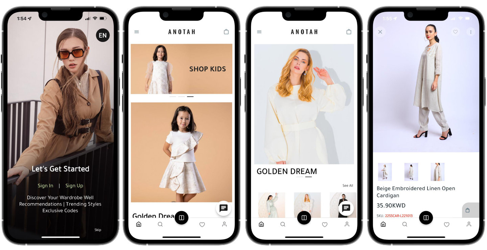

## Role

Senior Developer at Green Wing Co. W.L.L.

## Project Summary

I built and scaled the Anotah mobile app for both iOS and Android as part of the broader Green Wing commerce ecosystem.
The app was developed with **Flutter** as a unified cross-platform system for mobile commerce operations.

## Mobile Architecture

- Built a comprehensive cross-platform mobile system using Flutter.
- Integrated the app with WordPress/WooCommerce through API-based data and order flows.
- Kept mobile channels synchronized with web channels for products, stock, carts, and checkout behavior.
- Supported centralized operations where orders from multiple websites/channels were managed in one pipeline.

## Growth & Marketing Systems

- Built a Top 20 shopping app that helped increase sales by 48% through WooCommerce integration and optimized UX flows.
- Designed and advised app install and conversion systems using analytics-driven campaign optimization.

## App Demo Videos

<video controls playsinline preload="metadata" poster="/videos/anotah/anotah-app-intro-poster.jpg" src="/videos/anotah/anotah-app-intro.mp4"></video>

  <video controls playsinline preload="metadata" poster="/videos/anotah/anotah-app-intro-2-1920x1080-poster.jpg" src="/videos/anotah/anotah-app-intro-2-1920x1080.mp4" style="width:100%;"></video>
  <video controls playsinline preload="metadata" poster="/videos/anotah/anotah-app-recording-2026-03-03-1920x1080-poster.jpg" src="/videos/anotah/anotah-app-recording-2026-03-03-1920x1080.mp4" style="width:100%;"></video>

## Key Outcomes

- Delivered a reliable iOS and Android shopping experience tightly integrated with the core commerce stack.
- Improved conversion and repeat usage through performance-focused UX and streamlined purchase flow.
- Completed full publishing and release operations for both app platforms: Apple App Store and Google Play.

## Skills

- Mobile Applications
- App Development
- iOS Development
- Android Development
- E-Commerce
- Website Building
- E-commerce SEO
- Search Engine Optimization (SEO)
- WooCommerce Integration
- UX Optimization
- Analytics-driven marketing optimization

## Timeline & Location

Jan 2020 - Apr 2023 (3 yrs 4 mos) | Salmiya, Kuwait

## Related Project

- [Anotah Multi-Region E-commerce Website](/projects/anotah-website/) for Kuwait/GCC, Saudi Arabia, and global markets.
