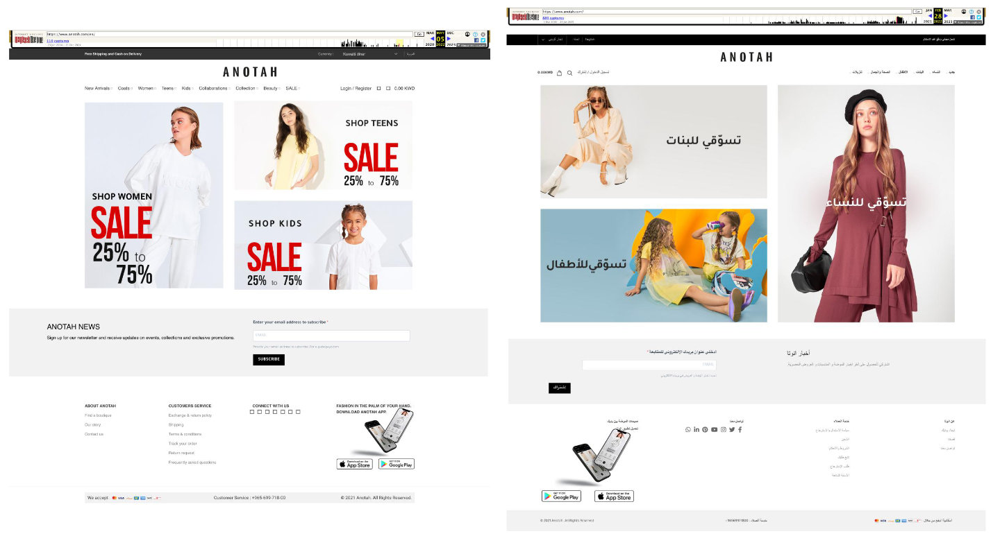
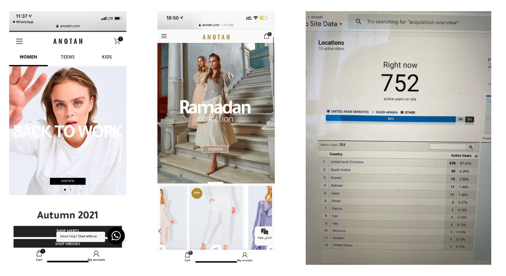
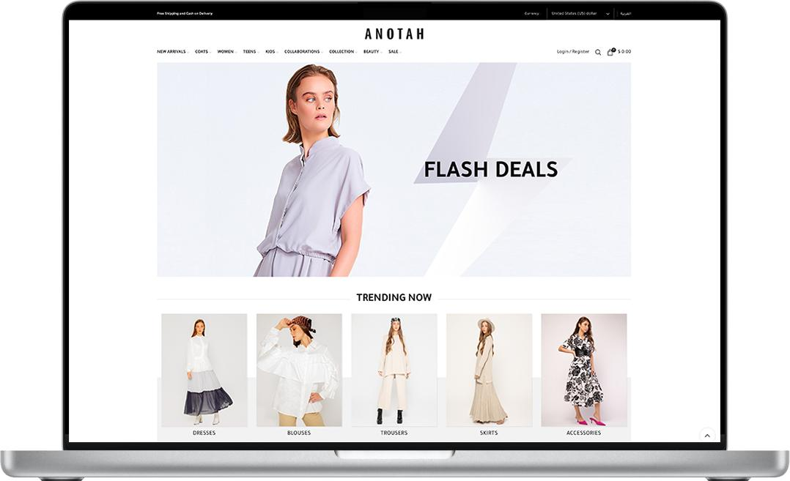

## Role

Senior Developer at Green Wing Co. W.L.L.

## Project Summary

I led development of the Anotah web ecosystem with three separate WooCommerce websites:

- Kuwait/GCC storefront
- Saudi Arabia storefront
- Global storefront for the rest of the world

The Kuwait/GCC storefront operated in both English and Arabic, and the platform used location/language behavior similar to Eleganza for regional routing.

## Platform Architecture & Traffic

- Built and maintained the websites on WordPress and WooCommerce.
- Implemented localized language and stock handling across regional storefronts and supply sources.
- Managed high-traffic operations at around **250,000 monthly visits** with strong server and resource management.
- Ensured product and category links resolved to the correct regional website with accurate redirects.

## Website Visuals

## Unified Commerce Operations

- Connected iOS and Android app flows to WordPress through API integration.
- Kept order operations centralized so channels did not run in isolation.
- Enabled simultaneous management of orders from five web sources/channels in one operational pipeline.

## Key Outcomes

- Led development of three WooCommerce platforms across two fashion brands (Anotah and Eleganza), with localized language and stock management, serving around 250K monthly visitors.
- Built a Top 20 shopping app that helped increase sales by 48% through WooCommerce integration and optimized UX flows.
- Designed and advised app install and conversion systems using analytics-driven campaign optimization.

## Skills

- Website Building
- Web Development
- WordPress
- WooCommerce
- E-Commerce
- E-commerce SEO
- Search Engine Optimization (SEO)
- Localization
- High-traffic performance operations
- Inventory and order orchestration
- Analytics-driven marketing optimization
- Mobile Applications
- iOS Development
- Android Development

## Timeline & Location

Jan 2020 - Apr 2023 (3 yrs 4 mos) | Salmiya, Kuwait

## Project Closure

These websites were discontinued because the operating model depended on a large on-site workforce that became unnecessary and unsustainable after COVID-19 disruptions. The business was later affected by product supply challenges, which led to shutdown of the website operations.

## Website Archive

Historical snapshots of the live website are available on Web Archive:
[anotah.com snapshots](https://web.archive.org/web/20220701000000*/anotah.com)

## Related Project

- [Anotah Mobile App](/projects/anotah-mobile-app/) for iOS and Android, connected to the same commerce ecosystem.
