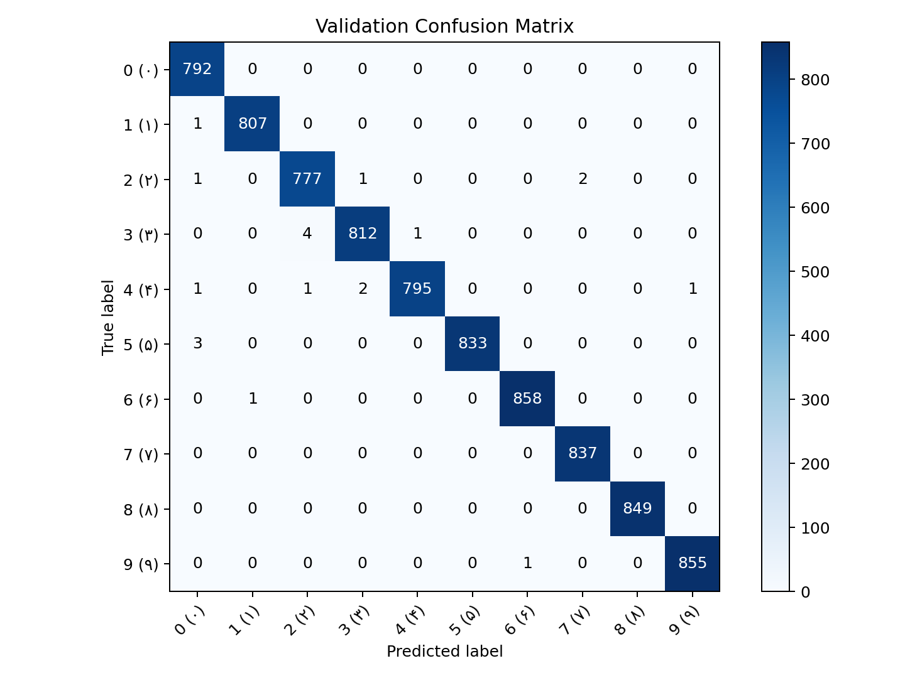
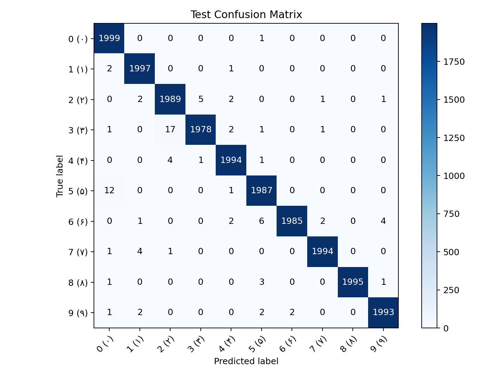

## Role

Developer - AI/ML Project

## Project Summary

This project delivers a full Persian digit recognition pipeline (`0..9`) with a custom PyTorch CNN and reproducible CLI workflows.
I implemented dataset preparation, model training, evaluation, and single-image inference scripts in one clean project structure.

## Repository

[CNN-based-Persian-digit-recognizer-built-with-PyTorch](https://github.com/danialza/CNN-based-Persian-digit-recognizer-built-with-PyTorch)

## What We Built

- Custom model `PersianDigitCNN` for 10-class classification.
- HODA dataset preparation pipeline with automated output generation.
- Training workflow with checkpointing and run metrics.
- Evaluation workflow on validation/test splits.
- Prediction script for single-image inference (`top-k` output).
- Confusion matrix generation for validation and test analysis.

## Model & Training Setup

- Architecture:
  - `Conv(1->32) + BatchNorm + ReLU + MaxPool`
  - `Conv(32->64) + BatchNorm + ReLU + MaxPool`
  - `Conv(64->128) + BatchNorm + ReLU + MaxPool`
  - `AdaptiveAvgPool(3x3)`
  - `Linear(1152->256) + ReLU + Dropout(0.3) + Linear(256->10)`
- Loss: `CrossEntropyLoss`
- Optimizer: `AdamW`
- Dataset: HODA

## Results

- Best validation accuracy: **99.76%**
- Test accuracy: **99.56%**
- Test loss: **0.0169**

## Confusion Matrices

## Skills

- AI
- Python
- Deep Learning
- PyTorch
- Computer Vision
- CNN Architecture
- Model Evaluation
