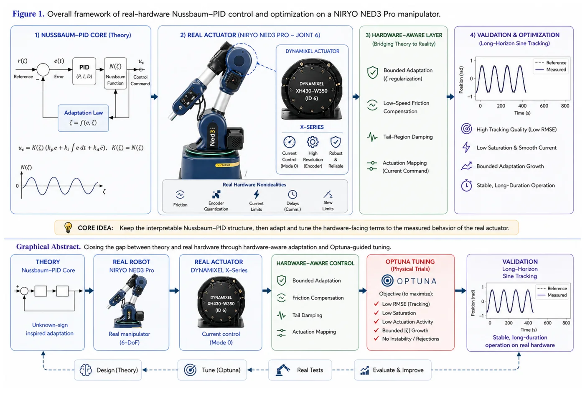
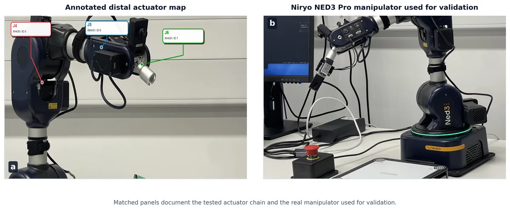
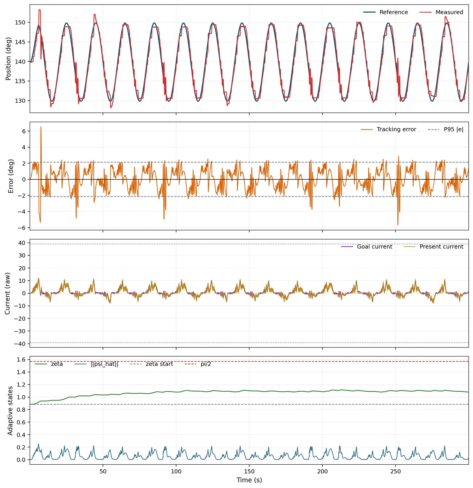
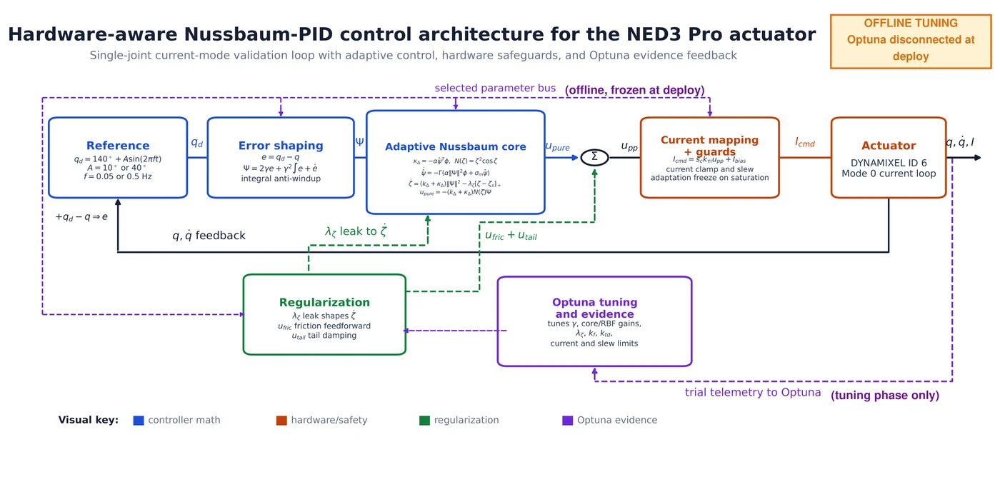
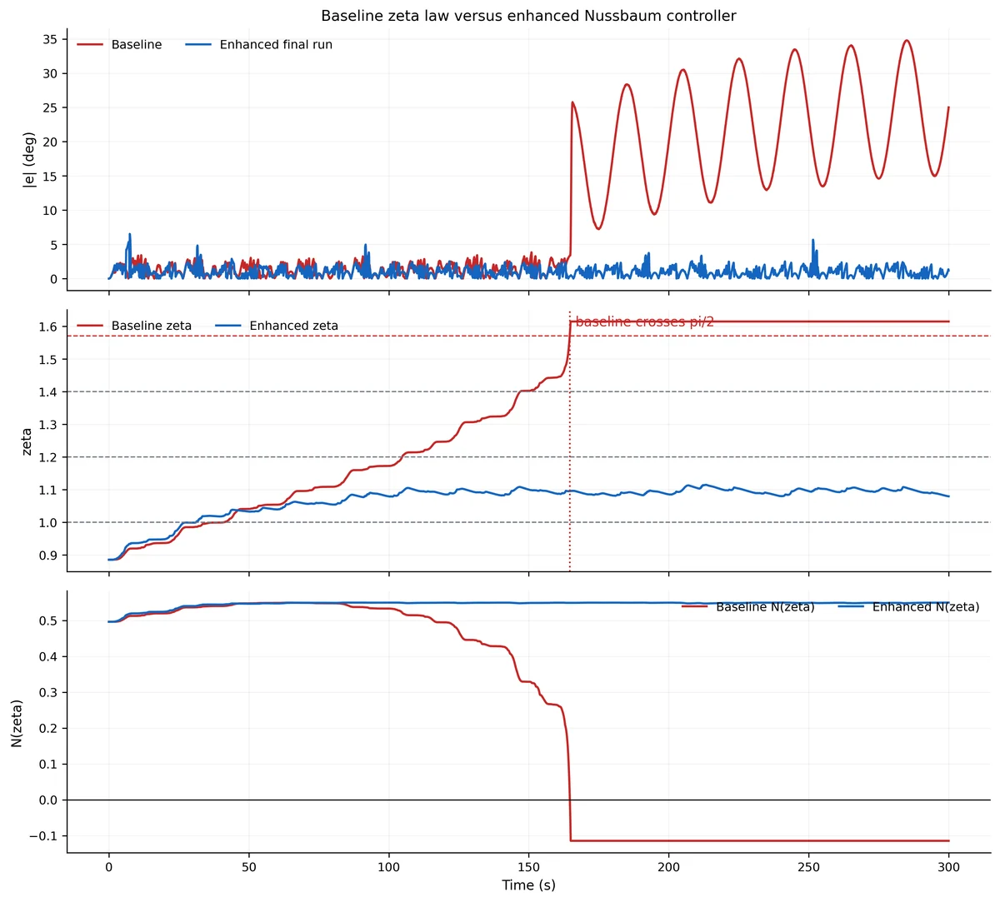
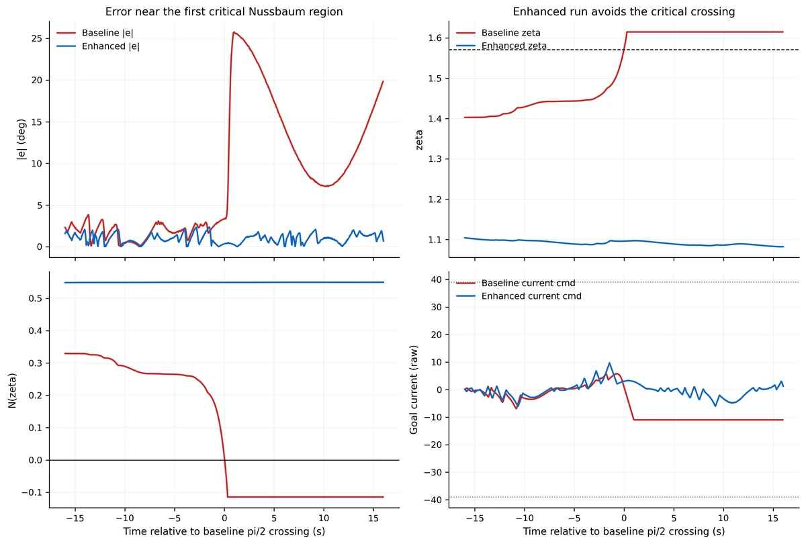
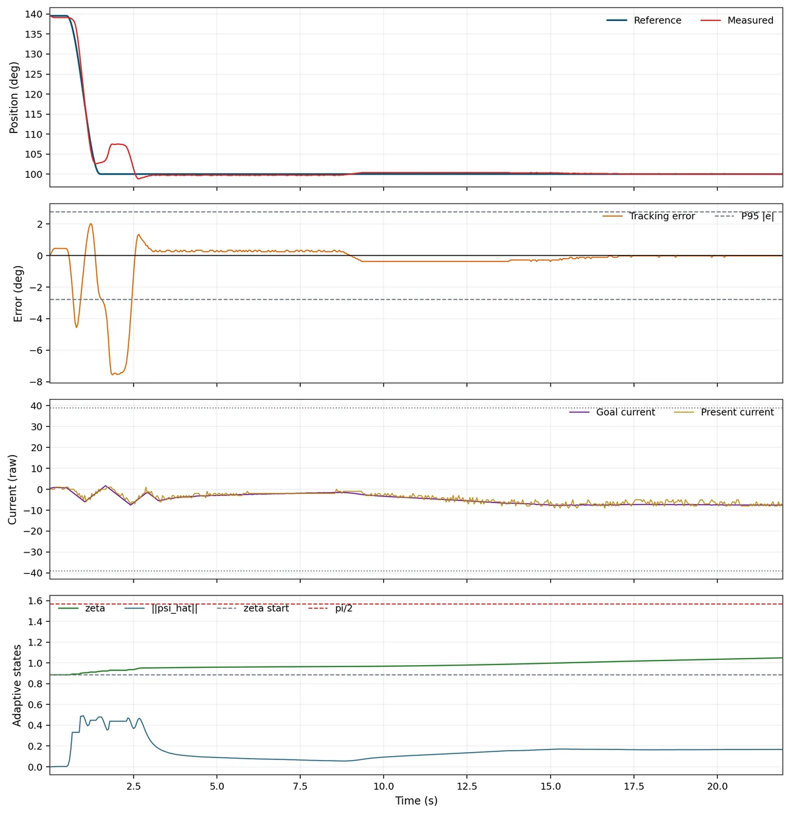
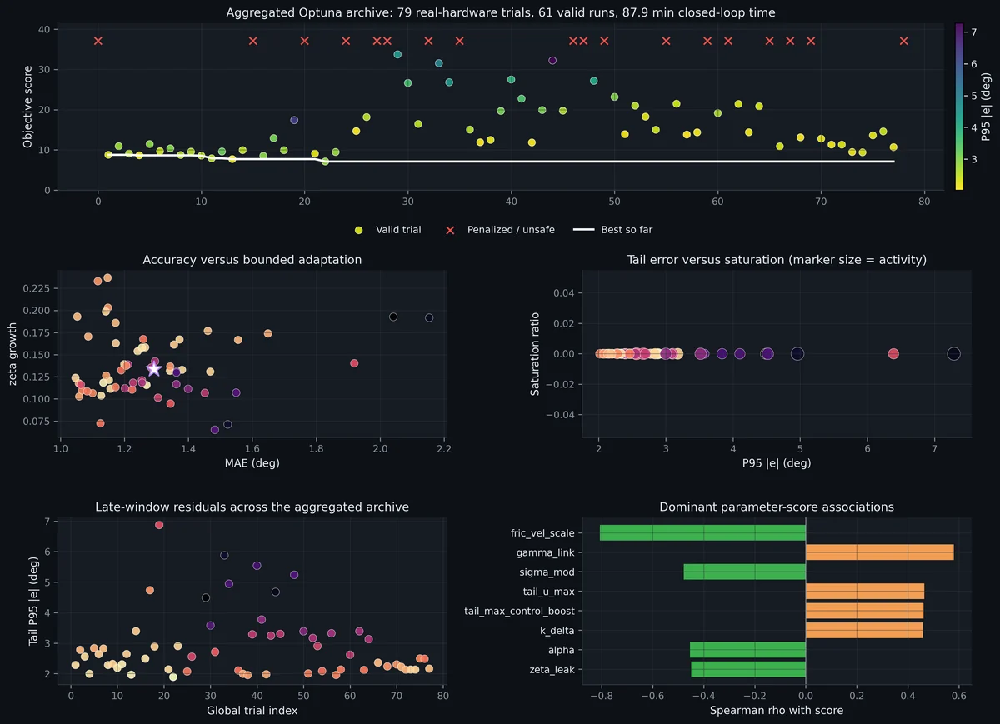

## Article

**Real-Hardware Deployment of a Nussbaum-Function PID Controller on a Current-Controlled Low-Cost Actuator via Hardware-Aware Optuna Tuning**

Danial Zafaranchizadeh Moghaddam, Olga Tveretina, and Abolfazl Zaraki, University of Hertfordshire, 2026.

This page provides project context, visual summaries, headline metrics, and access information for the preprint version of the manuscript.

**Preprint:** [preprints.org/manuscript/202606.0331](https://www.preprints.org/manuscript/202606.0331)

The article is currently available as a preprint and has been submitted to *Sensors*.

## One-Line Abstract

The paper shows that a direct Nussbaum-PID implementation degrades on a current-controlled low-cost actuator, then demonstrates that a hardware-aware Optuna-tuned variant recovers usable 300 s tracking by managing adaptation growth, actuation mapping, and saturation.

## Project Summary

This work studies real-hardware deployment of a Nussbaum-function PID controller on a current-controlled low-cost manipulator actuator, using the **Niryo NED3 Pro** as the experimental platform.

The experiments focus on real-hardware trajectory tracking for **Dynamixel ID 6 (Niryo J5 / distal wrist)** in raw current-command control. The study isolates deployment-layer behaviour from whole-arm Coriolis, centrifugal, and gravity dynamics, then tests how friction, encoder quantization, current limits, communication latency, and low-speed nonlinearities affect an adaptive controller that works cleanly in paper-level or simulation settings.

## Headline Result

Enhanced Nussbaum-PID on **Dynamixel ID 6 / Niryo J5**, 300 s sinusoidal validation at **10 degree / 0.05 Hz**:

| Metric | Result |
| --- | ---: |
| MAE | 1.054 degree |
| RMSE | 1.283 degree |
| P95 \|e\| | 2.145 degree |
| Max \|e\| | 6.530 degree |
| Saturation | 1.2% |

The direct baseline implementation degrades to **MAE = 10.476 degree** and an internal command saturation ratio of **0.450** on the same actuator. The enhanced implementation reduces the internal command saturation ratio to **0.012** while preserving the Nussbaum-PID core.

The tuned implementation adds three practical deployment layers:

- adaptation-state regularization
- low-speed velocity-reference feedforward
- tail-region damping

Parameters were selected from a hardware-aware Optuna archive of **79 real-hardware trials**, with unsafe runs rejected and the score jointly reflecting tracking quality, saturation, actuation activity, and bounded adaptation growth.

## Visual Summary

*Graphical abstract: the article connects Nussbaum-PID theory, the NED3 Pro / Dynamixel actuator, the hardware-aware layer, Optuna-guided tuning, and long-horizon validation.*

*Hardware platform used for the single-joint current-mode validation on the Niryo NED3 Pro.*

*Headline 300 s validation run at 10 degree / 0.05 Hz.*

*Hardware-aware Nussbaum-PID control architecture for the NED3 Pro actuator.*

## Key Figures

*Baseline versus enhanced controller comparison.*

*Critical-region zoom showing the failure mode around zeta approximately pi over 2.*

*Multi-envelope step-response evidence for the 40 degree condition.*

*Optuna search dashboard used to summarize tuning progress.*

## Code and Access

The paper’s implementation, experiment scripts, raw trial artefacts, and figure-generation utilities are currently being kept under controlled access rather than being fully public.

Public repository access page:

- [danialza/hardware-aware-nussbaum-pid](https://github.com/danialza/hardware-aware-nussbaum-pid)

For access to the code or supplementary implementation details, please contact:

- Danial Zafaranchizadeh Moghaddam — `danial.za@outlook.com`
- Abolfazl Zaraki — `a.zaraki@herts.ac.uk`

Planned access model:

- Keep the active implementation repository private.
- Publish only non-sensitive material on the public project page and preprint record.
- Share code, logs, and scripts with reviewers or collaborators on request.
- If a public artefact is needed later, release a cleaned companion package that excludes private hardware-control details, credentials, raw local paths, and unreleased experiment scripts.

This page will remain the public landing page for the study while access to the implementation is handled privately.

## Experimental Scope

The validated envelope includes:

- 10 degree and 40 degree sinusoids at 0.05 Hz and 0.5 Hz
- 15 degree and 40 degree step responses
- Bandwidth-limit characterization at 1.5-3 Hz
- Optuna-guided controller-parameter tuning and ablation analysis

Beyond the validated low-frequency envelope, the bandwidth probes show where the low-cost mechanical and sensing stack becomes the dominant limitation.

## Citation and Reuse

If you use the figures, experimental methodology, or any controlled-access implementation material shared with you, please cite the preprint and acknowledge the project page.

Recommended project-page reference:

> Project page and controlled-access implementation notes are available at: <https://danielz.co.uk/projects/hardware-aware-nussbaum-pid/>

Preprint:

> Real-Hardware Deployment of a Nussbaum-Function PID Controller on a Current-Controlled Low-Cost Actuator via Hardware-Aware Optuna Tuning. Preprints.org manuscript 202606.0331, 2026.

## Repository Access Status

To avoid exposing unreleased implementation details, the active implementation codebase is kept in a private repository. The public GitHub repository is maintained as an access-safe companion snapshot: project file names, figures, tables, and README descriptions remain visible, while Python implementation bodies are replaced with access-request placeholders.

Current public README wording:

> This public repository keeps the project page, file names, figures, tables, and README descriptions visible for manuscript context. The Python implementation bodies have been removed from the public copy. For access to the implementation code, reviewer material, or collaboration details, please email Danial Zafaranchizadeh Moghaddam at `danial.za@outlook.com` or Abolfazl Zaraki at `a.zaraki@herts.ac.uk`.

Before making any repository public, remove API keys, local paths, raw hardware-control scripts that should not be disclosed, generated logs that identify private setups, and any unpublished supplementary material.

## Related Work

- [Ned3 Pro Adaptive Controller](/projects/ned3pro-adaptive-controller/)
- [Ned3 Pro DRL Sim-to-Real Reaching](/projects/ned3pro-mujoco-rl-bundle/)
