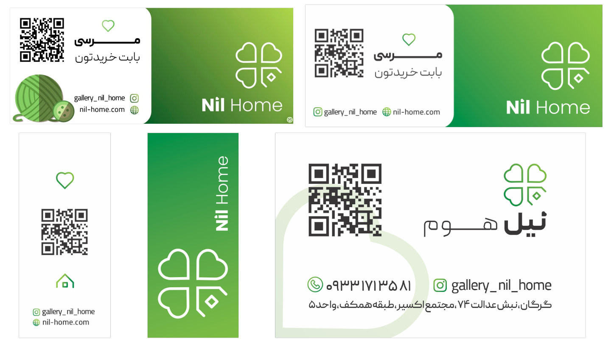
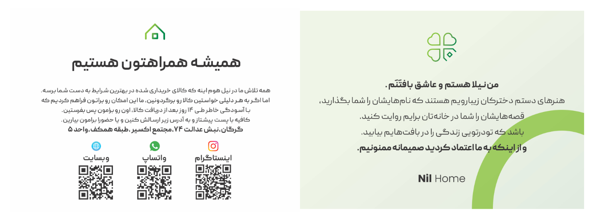

## Role

WordPress Senior Developer (Freelance) at Pasha Group.

## Project Summary

I developed Nil Home as an e-commerce website and migrated the business from an Instagram-based storefront to a full WooCommerce platform.

## Branding & Identity

Brand identity assets were designed and implemented to establish a consistent visual language for Nil Home.
Graphic design and branding for this project were done by [Sahand Anvari](https://www.linkedin.com/in/sahandanvari/).

## E-commerce Website

The website structure focused on product catalog clarity, conversion-oriented shopping flow, and maintainable WooCommerce operations.

## Key Outcomes

- Migrated Nil Home from a social storefront to a scalable WooCommerce website.
- Contributed to a reported 23% annual sales growth through platform migration and optimization.

## Skills

- Web Development
- WordPress
- WooCommerce
- E-commerce
- Branding
- Group training for marketing operations
- Built and organized a cross-functional team for content production, sales, shipping, and customer support

## Timeline & Location

Dec 2019 - Aug 2020 (9 mos) | Gorgan, Golestan Province, Iran (Hybrid)
