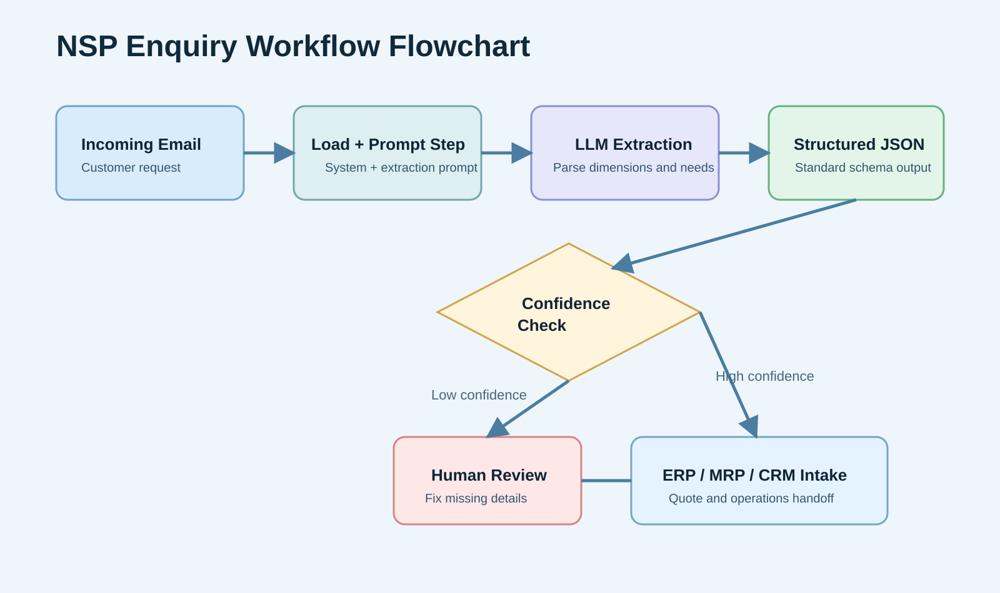
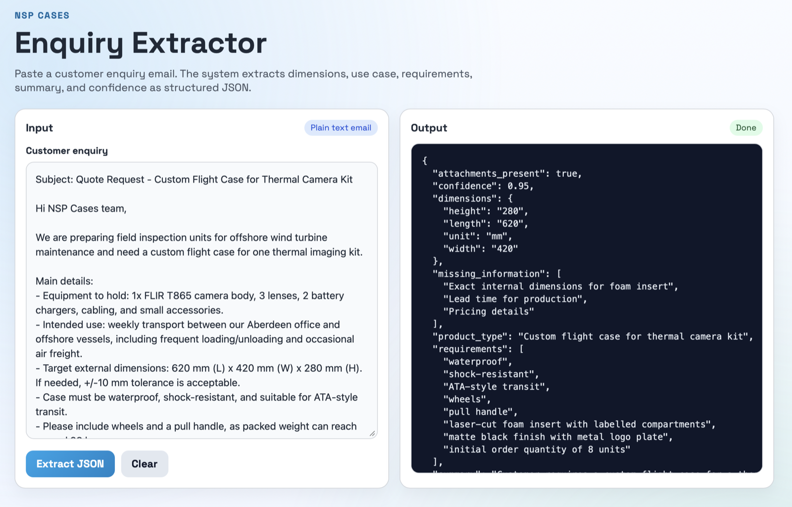

## Role

Developer - AI Workflow Prototyping

## Project Summary

This project delivers a practical AI-driven intake workflow for **NSP Cases**.
It reads customer enquiry emails for custom flight cases, extracts technical/commercial details with an LLM, and outputs a clean JSON payload ready for downstream operations.

After the initial version, the system was updated with a lightweight local web UI so the extraction workflow can be used directly from a browser.

The design was intentionally kept local, lightweight, and interview-ready:
- Python entry point (`main.py`)
- file-based prompts for fast prompt iteration
- provider call isolated so other LLM providers can be added later
- stable normalized output schema for ERP/MRP or CRM integration

## Repository

[nsp-ai-enquiry-workflow](https://github.com/danialza/nsp-ai-enquiry-workflow)

## What Was Implemented

- Input ingestion from `sample_email.txt`
- Prompt-driven extraction of:
  - product type
  - dimensions (`length`, `width`, `height`, `unit`)
  - use case
  - requirements
  - attachment mention detection
  - concise business summary
  - missing information list
  - confidence score
- JSON normalization and validation handling in Python
- Structured output writing to `output/example_output.json`
- Human-review-ready pattern via `missing_information` and `confidence`
- Added local web UI (`app.py` + Flask) with:
  - a single-page input/output screen
  - `POST /api/extract` endpoint integration
  - instant formatted JSON response for operations users

## Workflow Flowchart

*Flow from incoming enquiry email to structured output and optional human review before ERP/MRP handoff.*

## UI Update

*Updated UI for pasting enquiry text and getting structured JSON output instantly.*

## Key Outcomes

- Converted unstructured enquiry text into a predictable business schema.
- Improved readiness for scaling into larger quote/operations pipelines.
- Kept architecture simple enough for hiring-task review while still production-minded in structure.

## Skills

- AI Workflow Design
- Prompt Engineering
- Python
- API Integration
- Data Structuring
- Flask UI
