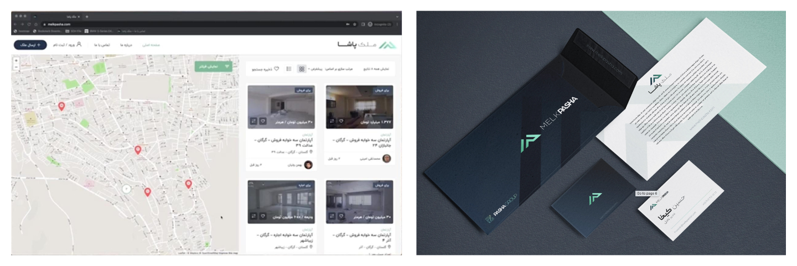

## Role

WordPress Senior Developer (Freelance) at Pasha Group.

## Project Summary

I developed the website for Pasha Group in the real estate domain and helped shape the project brand across group sub-brands.

The group started operating in two main tracks:

- **IzmirPasha**: Focused on property sales in Izmir, Turkey, with single-page showcases for construction projects and SEO work on Izmir real estate keywords through targeted blog content.
- **MelkPasha**: Focused on property sales and rentals in Iran, starting from Gorgan. We implemented 360 Virtual Reality tours for each property, which was rare in Iran at the time. Visitors could move through properties virtually and view spaces in 3D.

## Branding & Design

Branding and graphic design for this project were done by [Sahand Anvari](https://www.linkedin.com/in/sahandanvari/).

## Key Outcomes

- Delivered and maintained the main WordPress website for Pasha Group.
- Helped establish a consistent digital brand presence for the group and related brands.
- Created one of Iran’s only 3 real estate platform featuring complete 360° virtual tours (MelkPasha.com).

## Skills

- WordPress
- Web Development

## Timeline & Location

Mar 2018 - Aug 2020 (2 yrs 6 mos) | Gorgan, Golestan Province, Iran (Hybrid)
