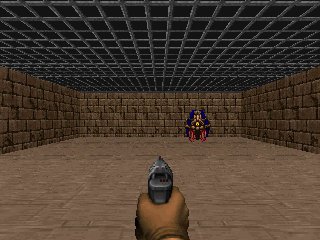
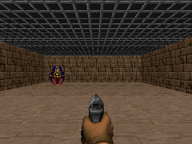
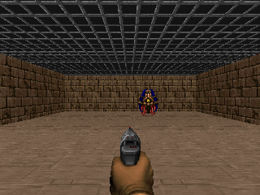

## Role

Developer - Agentic QA and AI Systems

## Project Summary

This project is a research-focused prototype for **QoE-driven automated bug discovery** in 3D game environments using **VizDoom**.
I designed and implemented a multi-agent pipeline that does more than simple log checking: it actively probes the environment, verifies whether anomalies are reproducible, and then generates structured bug reports ranked by user impact (QoE severity).

The core objective was to build a reproducible system that can help bridge the gap between raw runtime anomalies and triage-ready, research-usable bug intelligence.

## Repository

[QoE-Doom-BugHunter](https://github.com/danialza/QoE-Doom-BugHunter)

## Research Goal

The project evaluates how an agentic system can identify and prioritize game-breaking or experience-degrading issues by combining:
- active environment exploration,
- deterministic replay for verification,
- and weighted QoE scoring for severity ranking.

Instead of only asking "did the run fail?", the system asks "how bad is this for player experience, and how reproducible is it?"

## System Architecture

The workflow is built around three cooperating agents:
- **Explorer**: probes scenarios (seed sweep + random episodes), collects candidate issues, and stores minimal run context.
- **Inspector**: replays candidate conditions and verifies whether each issue is reproducible above threshold.
- **Reporter**: composes markdown/json bug reports with reproducibility statistics and QoE severity labels.

## Current Detection Strategy

The current discovery phase is intentionally **rule-based random exploration** (not RL):
- deterministic seed sweeps,
- random action probing,
- anomaly checks on frame repetition, reset/step exceptions, and reward numeric anomalies.

This gives a clear baseline for controlled research comparisons before introducing learning-based exploration policies.

## Detection Logic Implemented

The pipeline detects and classifies multiple anomaly categories:
- `SEED_NON_DETERMINISM`
- `STALL_NO_PROGRESS`
- `RESET_EXCEPTION`
- `STEP_EXCEPTION`
- `REWARD_NUMERIC_ANOMALY`

Two important verification paths were implemented:
- **Reset/dependency failure path** for runtime setup issues.
- **In-game stall path** for gameplay anomalies, including screenshot capture at the anomaly point.

## QoE Severity Model

Each verified issue is scored on a 0-100 QoE scale using weighted dimensions:
- frustration: **35%**
- fairness: **25%**
- immersion disruption: **20%**
- usability/comfort: **20%**

Severity mapping:
- **Critical**: 80+
- **High**: 60-79
- **Medium**: 35-59
- **Low**: 0-34

A reproducibility penalty is included so unstable one-off anomalies are ranked lower than repeatable issues.

## Example Evidence (In-Game Stall Run)

Reference screenshot used in the repository README:

The run pipeline generated screenshot evidence directly from anomaly moments:

In the reference stall run, all discovered candidates were verified, and reports were automatically generated with a **High** QoE severity classification for the confirmed pattern.

## Generated Outputs

For each run, the system produces:
- candidate and verified issue sets,
- per-issue evidence JSON,
- captured screenshots,
- markdown + JSON bug reports,
- run-level metrics including:
  - confirmed unique bugs/hour,
  - average reproducibility rate,
  - evidence quality score.

## Key Outcomes

- Built a complete end-to-end agentic bug discovery pipeline, not just a detector.
- Added reproducibility-aware verification to reduce noisy false positives.
- Converted technical anomalies into structured, triage-ready bug reports.
- Established a practical baseline for PhD-aligned QoE-driven bug research in interactive 3D environments.

## Skills

- AI Systems
- Agentic Workflows
- Bug Discovery Automation
- Quality of Experience (QoE) Modeling
- Reproducibility Testing
- Python
- Robotics/Game Environment Integration
