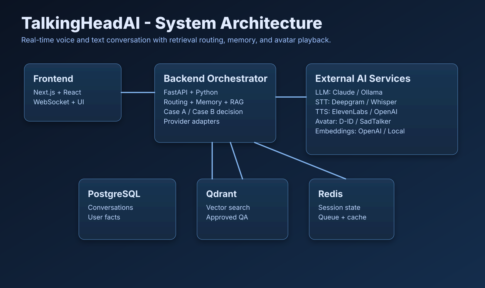
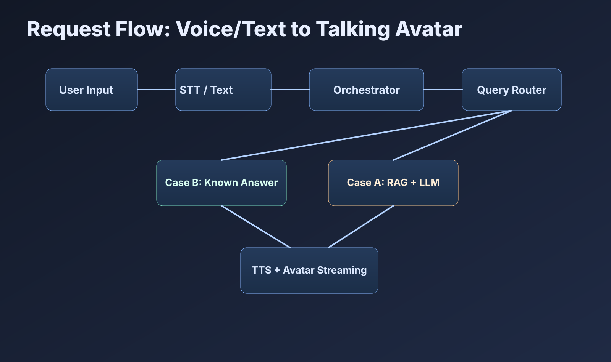
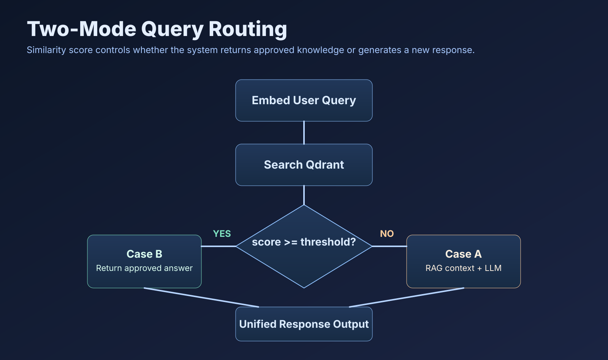
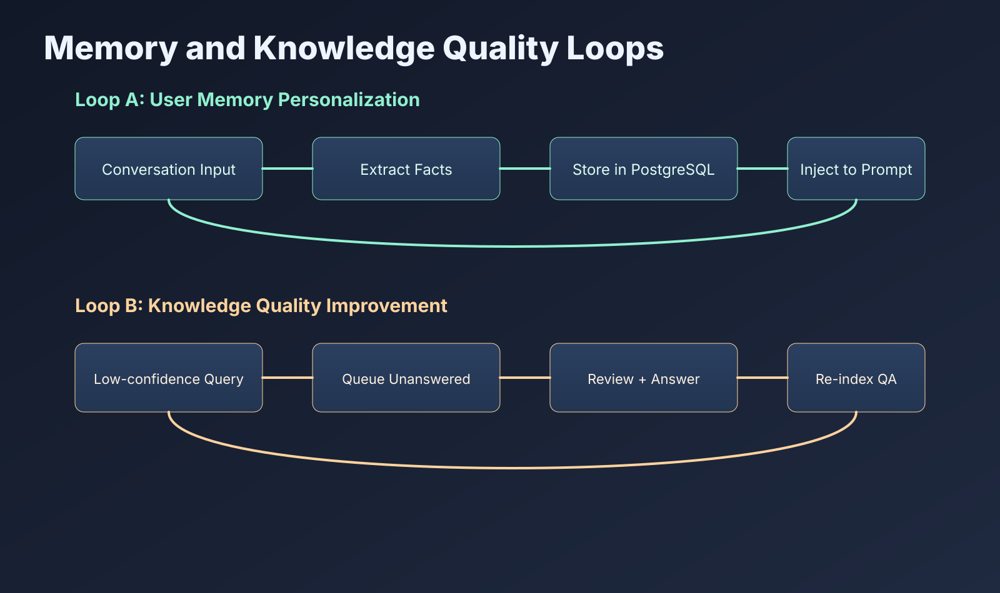

## Role

Developer - AI Systems Architecture and Full-Stack Integration

## Project Summary

This project is a real-time conversational talking-head system where users interact by voice or text and receive synchronized avatar responses.
The platform combines speech-to-text, routing, retrieval, generation, text-to-speech, and avatar streaming in one loop, with persistent memory and a reviewer-driven quality pipeline.

## Repository

[TalkingHeadAI](https://github.com/danialza/TalkingHeadAI)

## Systems Used

- Backend API and orchestration: Python 3.11, FastAPI, async SQLAlchemy
- Frontend client: Next.js 14, React 18, TypeScript, Tailwind CSS
- Structured data layer: PostgreSQL 16
- Vector retrieval layer: Qdrant
- Cache and queue layer: Redis
- LLM and generation services: Claude (primary), optional Ollama path
- Embeddings: OpenAI text-embedding-3-small (with local fallback design)
- Speech pipeline: Deepgram (STT) + ElevenLabs/OpenAI (TTS)
- Avatar rendering: D-ID streaming mode with offline fallback path
- Runtime and local orchestration: Docker Compose

## Architecture Overview

The architecture separates concerns into a frontend interaction layer, an orchestration backend, persistent data stores, and pluggable external AI services. This structure keeps provider changes isolated from core business logic.

## End-to-End Request Flow

Main flow steps:
- Accept user voice or text input.
- Convert voice to text (or pass through plain text).
- Run orchestrator checks and context enrichment.
- Route request by similarity confidence.
- Generate final text response.
- Convert response to speech and stream through avatar output.

## Two-Mode Routing Logic

Routing is based on similarity threshold:
- Case B (known): if confidence is above threshold, return reviewed knowledge-base answers directly.
- Case A (new): if confidence is below threshold, build context via retrieval and generate response with the LLM.

This design keeps high-confidence answers deterministic while still supporting open queries.

## Memory and Quality Loops

Loop A (memory personalization):
- Extract user facts from conversation context.
- Persist structured facts in PostgreSQL.
- Inject relevant memory into future prompts.

Loop B (quality improvement):
- Capture low-confidence or unanswered queries.
- Queue and review them in the reviewer workflow.
- Approve and re-index answers into the knowledge base.

## Core Backend Responsibilities

- Session and conversation orchestration
- Similarity-based route selection
- Retrieval-augmented generation assembly
- User memory extraction and recall
- Provider abstraction for STT, LLM, TTS, and avatar systems
- Reviewer endpoints for unanswered-question lifecycle

## Key Outcomes

- Delivered a production-style architecture for low-latency conversational avatar interactions.
- Built a scalable two-path routing strategy for known vs novel queries.
- Added long-term user memory for personalization across sessions.
- Implemented a continuous reviewer feedback loop to improve answer quality over time.

## Skills

- AI Systems Design
- Real-Time Orchestration
- Retrieval-Augmented Generation (RAG)
- Backend API Engineering
- Vector Search Integration
- Conversation Memory Design
- Automation Workflow Design
- Python
