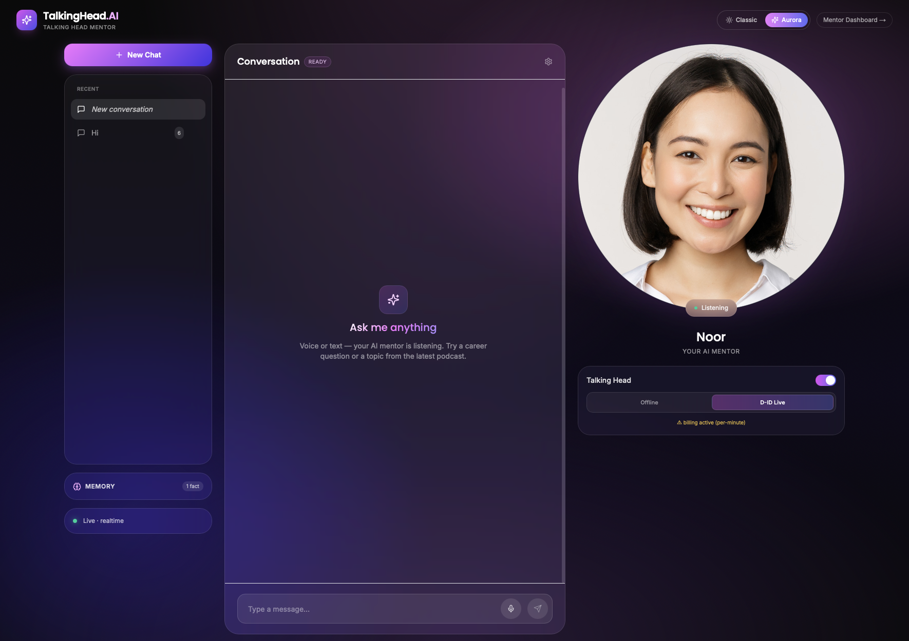
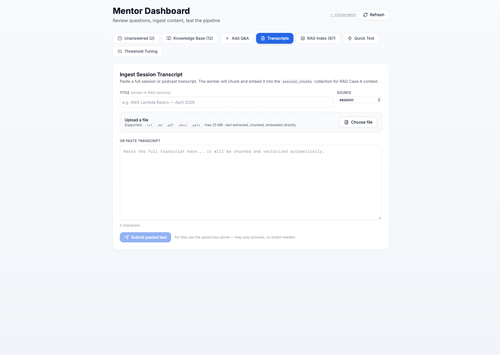
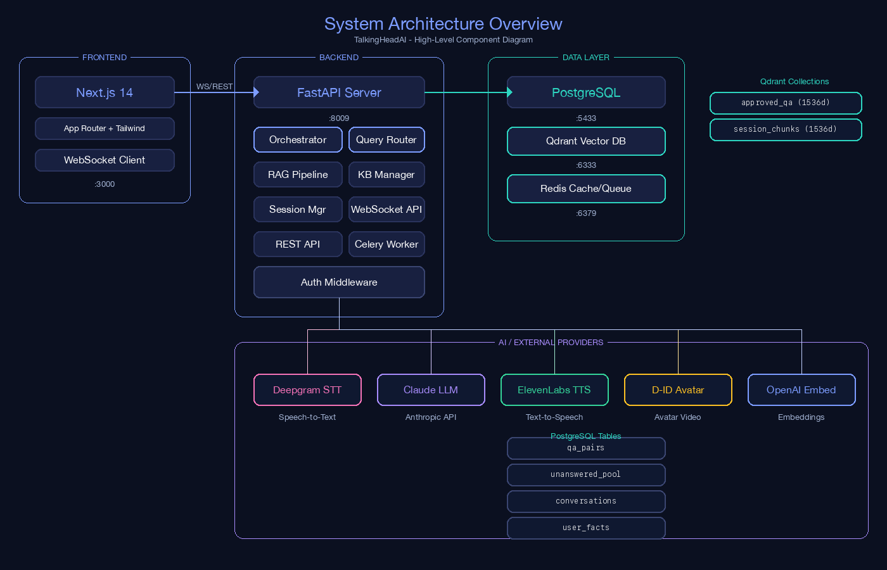
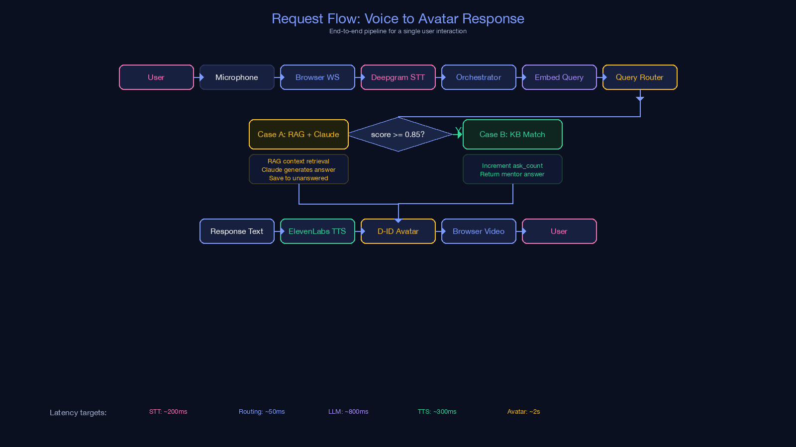
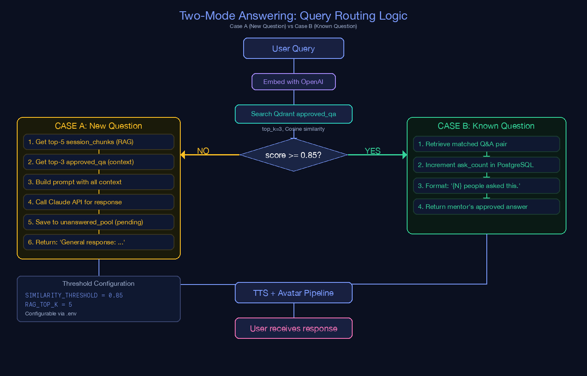

## Role

Developer - AI Systems Architecture and Full-Stack Integration

## Project Summary

This project is a real-time conversational talking-head mentor system where users ask questions by voice or text and receive synchronized, lip-synced avatar responses.
The platform combines speech-to-text, routing, retrieval, generation, text-to-speech, and avatar streaming in one loop, with persistent memory, bilingual Persian/English handling, mentor-approved answers, and an admin dashboard for transcript ingestion, knowledge-base review, RAG index checks, quick tests, and threshold tuning.

## Repository

[TalkingHeadAI](https://github.com/danialza/TalkingHeadAI)

## Project Overview Video

<video controls playsinline preload="metadata" poster="/videos/talking-head-ai/talkingheadai-overview-poster.jpg" src="/videos/talking-head-ai/talkingheadai-overview.mp4" style="width:100%; border-radius: 14px; background: #000;"></video>

This walkthrough shows the complete TalkingHeadAI experience from the user-facing avatar interface through the mentor dashboard used to manage the knowledge pipeline.

## Product Screenshots

### Frontend: Conversational Avatar Interface

The frontend presents a live conversational workspace with chat history, memory visibility, realtime status, microphone/text input, and a talking-head mentor avatar named Noor. The UI supports voice or text interaction, Persian RTL and English LTR auto-detection, and keeps the avatar state visible, including the D-ID live mode toggle.

### Backend/Admin: Mentor Dashboard

The mentor dashboard is the operational side of the system. It includes unanswered-question review, knowledge-base management, manual Q&A insertion, transcript ingestion, RAG index inspection, quick testing, and threshold tuning. The transcript screen supports pasted content and file upload for `.txt`, `.md`, `.pdf`, `.docx`, and `.pptx` files, then chunks and embeds the content into the `session_chunks` retrieval collection.

## Systems Used

- Backend API and orchestration: Python 3.11, FastAPI, SQLAlchemy 2.0 async, Celery
- Frontend client: Next.js 14, React 18, TypeScript, Tailwind CSS, Vazirmatn RTL support
- Mentor dashboard: unanswered queue, knowledge-base review, Q&A creation/edit/delete, transcript ingestion, RAG index inspection, quick tests, and threshold tuning
- Structured data layer: PostgreSQL 16
- Vector retrieval layer: Qdrant
- Cache and queue layer: Redis
- LLM and generation services: Claude Sonnet 4.5, optional Ollama path
- Embeddings: OpenAI text-embedding-3-small (1536 dimensions), with local fallback design
- Speech pipeline: Deepgram (STT) + ElevenLabs/OpenAI (TTS)
- Avatar rendering: D-ID WebRTC streaming, D-ID clip mode, and SadTalker offline fallback path
- Transcript ingestion pipeline: text/file upload, document parsing, chunking, embedding, and `session_chunks` indexing
- Runtime and local orchestration: Docker Compose

## System Diagrams

### 1) System Architecture Overview

This diagram shows the full component map:
- Frontend layer: Next.js App Router + Tailwind + WebSocket client.
- Backend layer: FastAPI server with orchestrator, query router, RAG pipeline, KB manager, REST and WebSocket APIs, and worker services.
- Data layer: PostgreSQL, Qdrant, and Redis with clear service ports.
- External providers: Deepgram (STT), Claude (LLM), ElevenLabs (TTS), D-ID (avatar), and OpenAI embeddings.

It explains how boundaries are defined between product UI, decision logic, stateful storage, and AI provider integrations.

### 2) Request Flow: Voice to Avatar Response

This flow shows the runtime sequence for one user interaction:
- User audio enters through microphone and browser WebSocket.
- STT converts speech to text and passes it to the orchestrator.
- Query embedding + router decide between Case A and Case B.
- Output text goes through TTS and then avatar video rendering.
- Final response is delivered back to the browser as synchronized audio/video.

The latency notes in the diagram clarify where response time is spent across STT, routing, generation, TTS, and avatar rendering.

### 3) Two-Mode Answering: Query Routing Logic

This diagram explains the retrieval threshold strategy:
- User query is embedded and searched against `approved_qa` in Qdrant.
- If similarity score is above threshold (`>= 0.85`), the system runs Case B, returns mentor-approved knowledge, and increments `ask_count`.
- If below threshold, it runs Case A, pulls `session_chunks` + approved context, calls Claude, and stores unresolved items in `unanswered_pool`.

It documents why the system can stay reliable for known questions while still handling new questions dynamically.

### 4) Knowledge Quality Loop

This loop shows how unanswered questions become reusable knowledge:
- New/low-confidence queries are saved to `unanswered_pool`.
- Similar unanswered questions are semantically clustered for mentor review.
- Mentor dashboard is used for answer, dismiss, bulk answer, or split-variant actions.
- Approved answers are inserted into `qa_pairs` and upserted to Qdrant.
- Future similar queries increasingly hit Case B, reducing ambiguity and response variance over time.

It captures the continuous improvement mechanism of the platform's knowledge base.

### 5) User Memory Feature: Extraction and Recall

This diagram describes personalized memory behavior:
- During interaction, facts are extracted asynchronously (non-blocking path) while normal response continues.
- Structured facts are persisted in `user_facts` with upsert logic.
- On later interactions, user facts are loaded and injected into the system prompt before generation.
- Frontend memory card supports user visibility and safe reset actions.

It explains how personalization is implemented without adding blocking latency to the main conversation path.

## Core Backend Responsibilities

- Session and conversation orchestration
- Similarity-based route selection
- Retrieval-augmented generation assembly
- User memory extraction and recall
- Provider abstraction for STT, LLM, TTS, and avatar systems
- Reviewer endpoints for unanswered-question lifecycle
- Transcript ingestion, chunking, embedding, and RAG index maintenance
- Quick-test and threshold-tuning flows for retrieval behavior
- Qdrant source/chunk deletion flows for RAG index cleanup
- Persistent `session_transcripts`, `conversations`, and `user_facts` storage

## Key Outcomes

- Delivered a production-style architecture for low-latency conversational avatar interactions.
- Built a scalable two-path routing strategy for known vs novel queries.
- Added long-term user memory for personalization across sessions.
- Implemented a continuous reviewer feedback loop to improve answer quality over time.
- Added a mentor dashboard for ingesting content, reviewing unresolved questions, testing the pipeline, and tuning retrieval thresholds.
- Added bilingual Persian RTL and English LTR handling for the product interface.
- Added file-upload based transcript ingestion and RAG source management for university-style demo scenarios.

## Skills

- AI Systems Design
- Real-Time Orchestration
- Retrieval-Augmented Generation (RAG)
- Backend API Engineering
- Vector Search Integration
- Conversation Memory Design
- Automation Workflow Design
- Python
