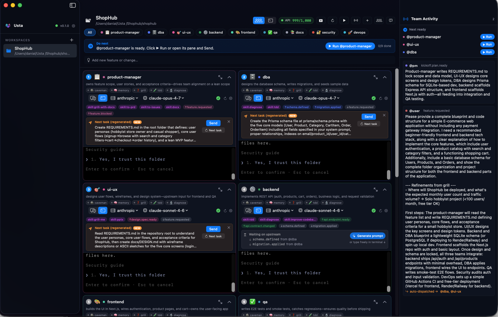
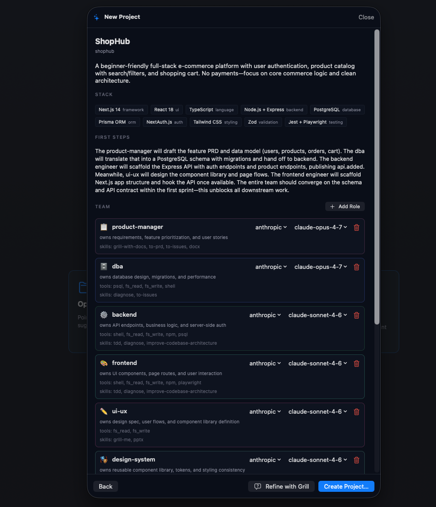

## Role

Founder and Developer - Native macOS App, Multi-Agent Runtime, and Product Design

## Project Summary

**Usta** is a native macOS IDE for running an AI engineering team rather than a single assistant.

The project starts from a simple idea: real software work has roles, handoffs, blockers, reviews, and parallel tasks. Usta gives that workflow a local-first desktop interface. A PM agent reads the project brief, decides which specialists are needed, writes role-specific instructions, launches each role in its own live terminal session, and coordinates the work through a shared event bus.

The result is a workspace where frontend, backend, QA, security, design, DevOps, docs, mobile, data, or research agents can work in parallel while the user watches progress and unblocks the next bottleneck.

## Links

- [Live website](https://usta-ai.vercel.app)
- [GitHub repository](https://github.com/danialza/Usta)
- [Visual guide](https://usta-ai.vercel.app/guide.html)
- [macOS releases](https://github.com/danialza/Usta/releases)

## Product Screenshots

*Usta workspace: one project, multiple specialist agents, separate live sessions, and shared coordination.*

*PM proposal flow: Usta reads the project and proposes the team, stack, and role responsibilities before launching the workspace.*

## What Was Built

- Native macOS app for managing multi-agent engineering workspaces.
- PM auto-orchestration that turns a project idea into a dynamic specialist team.
- Role-specific agent sessions with separate prompts, tools, context, and live terminal state.
- Shared event bus for inter-agent coordination and handoff announcements.
- Real PTY integration so each role can run in its own persistent terminal.
- Idle watcher that detects when an agent finishes and publishes its status.
- Bottleneck / next-action surface to show which role needs attention.
- Pluggable model support for Anthropic, Gemini, and local Ollama workflows.
- Keychain-backed API key storage so provider credentials are not written to normal project files.
- MCP server support so external MCP-compatible clients can interact with Usta's bus.
- Skills system for reusable behaviours such as memory, TDD, diagnosis, and sharper clarification flows.
- Public product website, visual guide, GitHub release flow, README, licensing, and trademark notes.

## How It Works

The core workflow has three stages:

1. Open a codebase or describe a new idea.
2. The PM agent analyzes the project and proposes a purpose-built team.
3. Usta launches the selected specialists as parallel sessions, then uses the event bus and watcher loop to coordinate handoffs.

Instead of forcing every task through one chat context, Usta separates responsibility across roles. A frontend agent can focus on UI, a backend agent can work on API concerns, QA can react when implementation lands, and a docs agent can capture the outcome. The user stays in the loop, but no longer has to manually copy every handoff between assistants.

## Systems Used

- Native app: SwiftUI and Swift 6 concurrency
- Terminal sessions: SwiftTerm with real PTYs and persistent scrollback
- Runtime daemon: Rust, tokio, and tonic gRPC over Unix Domain Socket
- Local state: SQLite for events, scrollback, role state, and coordination metadata
- Agent providers: Anthropic, Gemini, and Ollama
- Security: macOS Keychain for API keys
- Integration layer: MCP stdio server
- Distribution: macOS DMG release workflow through GitHub Releases
- Product site: static landing page and visual guide deployed on Vercel

## Engineering Focus

Usta is designed around the parts of software work that single-assistant workflows usually hide:

- Team composition: the right roles should depend on the project, not a fixed menu.
- Handoffs: agents need a durable way to publish progress and trigger the next role.
- Terminal reality: each role should have a live shell, not just abstract tool calls.
- Local control: user code, credentials, and context should stay on the user's machine wherever possible.
- Recoverability: scrollback, role state, and event history should survive daemon restarts.

## Current Status

Usta has its first public macOS release available through GitHub Releases. The current version is focused on proving the multi-agent desktop workflow, the PM planning loop, the event bus, the native workspace experience, and the release path for early users.

## Roadmap

- Expand beyond macOS with Linux and Windows support.
- Strengthen fully local workflows with Ollama-first defaults.
- Add a community role marketplace for sharing specialist role definitions.
- Add cloud sync for the event log where users want cross-machine continuity.
- Explore a VS Code extension as an alternative interface for the same coordination model.

## Skills

- Native macOS App Development
- SwiftUI
- Rust Runtime Engineering
- Multi-Agent System Design
- MCP Integration
- LLM Tooling
- Product Design
- Developer Experience
